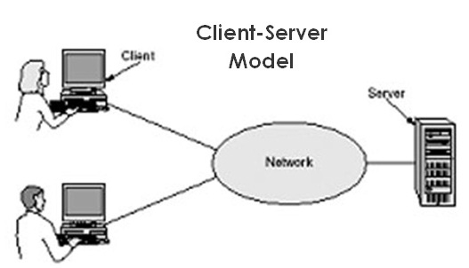

# Overview
Before dive in to cookie and session lession, you should understand the `Client - Server` model first.

## What is Client Server Model?

Client-server is a relationship in which one program (the client) requests a service or resource from another program (the server).

__You can understand as:__

- You (your computer) is called `client`  if you buy (`request`) some images, videos, musices, eg (we called it is `resources`) from the store (`other computers`, usually is big and power computers).
- The store (computers) that you bought (requested) and get resources was called `server`.

  The server can provide the resources for many clients at the same time.

- The vehicle (car, bike, walk,...) that used to transit the goods from the store to you is called `protocol`. In Client-Server model we called it is `Hypertext Transfer Protocol (HTTP or HTTPS)`
- The store's address is called `Domain Name System (DNS)`
- Beside, we have another ways to communicate with the server such as `Simple Mail Transfer Protocol [(SMTP)](https://whatismyipaddress.com/smtp), [Telnet](https://www.computerhope.com/jargon/t/telnet.htm).

> So, does it relate to `Cookie` and `Session`?

*Example:*

When you bought somethings, the store owner give you a bill which save some information about you and the store and what you bougth. And you keep that bill, and the store keep the copied one.

So the next some days, you don't satisfy about the goods you bougth, you wanna return it to the store. How the store know that you bougth their goods? Now, the bill was to to prove it.

- The bill that you are keeping was called `Cookie`.
- The bill that the store owner is keeping was called `Session`

In Web model, `Cookie` was saved at you browser (at the Client). `Session` was saved at the Server.

To get more understand about Cookie, Session, check below items:

1. [Cookie](https://www.w3schools.com/js/js_cookies.asp)
2. [Session](https://www.w3schools.com/php/php_sessions.asp)

> Note: Each Programing languague (Java, C#, PHP,...) have its way to create and storage the session.
>
> _Example:_ In Java, they use `HttpSession`, C# is `HttpContext`, PHP is `$_SESSION`, etc.
>
> Here is just taking about PHP Session because you studying PHP also.

# Why to use Cookie / Session?
In some cases, you don't want to input the similar data many times, so you can use Cookie/Session to save it and reuse later.

_For example_
> You have a bank account, you wanna check the account balance, For secure, you have to login before you can check it. After that you wanna withdrawn and of course, you have to login because of secure,
>
> We have to login each time we do an action? So to save time, at the first login time, we will create a session to save your login info and your machine you are using.
>
> So that, in the next action, the server will authorize you base on that session, if that is you, you can do another action, if that is not use, login action will be required.

# When to use Cookie / Session?
Basically, you can use Cookie/Session to save anything inforamation as you want. `BUT you SHOULD`

- Use Cookie to store the information that does `NOT NEED to SECURE`
- Use Cookie to store value in short term (a few days)
- Use Cookie to store a small data (less than 4kb)

- Use Session to store the `SECURE` data like access token, usename and password, etc
- Use Session to store data that you want it to be destroy after terminate the session (session_destroy)
- Use Session if you want store a litle bit large data and temporary in the server (from a few Mb to few hundred MB depends on the Framework/Language)

