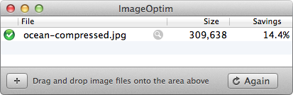
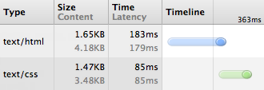
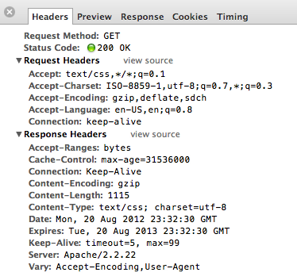

# Overview
You want to watch a video on the internet. Do you like to wait for long time 5 min, 10 min for loading the content? Or just want to read a newspapers but wait for 3-5 min for loading the content

No? Me too. To build up a website may not be hard. But to let it do its tasks fast is not easy.

Here is some factors you need to consider when developing the website.

# Some factors affect to your web perfomances.

## 1. HTML / CSS performance

Having the ability to [write HTML and CSS](https://learn.shayhowe.com/html-css/writing-your-best-code/) with a solid understanding is a great expertise to have. As a website’s code base and traffic grows, a new skill set comes into play, one that is extremely important to both development time and user experience. Knowing the fundamentals of website [performance](https://developer.yahoo.com/performance/rules.html) and organization can go a long way.

The organization and architecture of a code base can greatly affect not only the speed of development, but also the speed at which pages render. Both of which can be sizeable concerns not only for developers but also users. Taking the time to design the right structure for a code base, and identify how all of the different components will work together, can speed up production and make for a better experience all around.

Additionally, taking a few small steps to improve the performance of a website can pay off in dividends. Website performance greatly resembles the 80/20 rule, where 20% of the optimizations will speed up roughly 80% of the website.

### 1.1 Strategy & Structure

The first part to improving a website’s performance and organization revolves around identifying a good strategy and structure for developing the code base. Specifically, building a strong directory architecture, outlining design patterns, and finding ways to reuse common code.

#### **Style Architecture**

Exactly how to organize styles boils down to personal preference and what is best for a given website but generally speaking there are best practices to follow. One practice includes separating styles based on intent, which includes creating directories for common base styles, user interface components, and business logic modules.

```apache
# Base
  – normalize.css
  – layout.css
  – typography.css

# Components
  – alerts.css
  – buttons.css
  – forms.css
  – list.css
  – nav.css
  – tables.css

# Modules
  – aside.css
  – footer.css
  – header.css

```

The architecture outlined above includes three directories, all with individual groups of styles. The goal here is to start thinking of websites as systems rather than individual pages, and the code architecture should reflect this mindset. Notice how there aren’t any page specific styles here.

The base directory includes common styles and variables to be used across the entire website, layout and typography styles for example. The components directory includes styles for specific user interface elements which are broken down into different component files such as alerts and buttons. Lastly, the modules directory includes styles for different sections of a page, which are determined by business needs.

The component styles are purely interface driven and have nothing to do with the core business logic of the website. Modules then include styles specific to the business logic. When marking up a module in HTML it is common to use different user interface components within it. For example, the sidebar of a page may have list and button styles that are defined within component styles while other styles needed for the sidebar are inherited from the module style. The separation of style encourages well thought out presets and the ability for styles to be widely shared and reused.

The strategy of organizing styles this way isn’t exactly new, and has been previously mentioned in different CSS methodologies including Object Oriented CSS, OOCSS, and the Scalable and Modular Architecture for CSS, SMACSS. These methodologies have their own opinions on structure, as well as on how to use styles.

### **Object Oriented CSS**

The [Object Oriented CSS](http://oocss.org/) methodology was pioneered by Nicole Sullivan in her work with writing styles for larger websites. Object Oriented CSS identifies two principles that will help build scalable websites with a strong architecture and a reasonable amount of code. These two principles include:

>- Separate structure from skin
>- Separate content from container

Overall `separating structure from skin` includes abstracting the layout of an element away from the theme of a website. The structure of a module should be transparent, allowing other styles to be inherited and displayed without conflict. Most commonly this requires a solid grid and layout structure, along with well crafted modules.

`Separating content from the container` involves removing the dependency of a parent element nesting children elements. A heading should look the same regardless of its parent container. To accomplish this, elements need to inherit default styles, then be extended with multiple classes as necessary.

```html
<!-- HTML -->
<div class="alert alert-error">
  <p class="msg">...</p>
</div>

```
```css
/* CSS */
.alert {...}
.alert-error {...}
.msg {...}
```

Object Oriented CSS advocates building a component library, staying flexible, and utilizing a grid. These are good ground rules, and they can help you avoid the need to add additional styles every time you add a new page or feature to a website.

### **Scalable & Modular Architecture for CSS**

Along the same line of [Object Oriented CSS is the Scalable and Modular Architecture for CSS ](http://smacss.com/) methodology developed by Jonathan Snook. The Scalable and Modular Architecture for CSS promotes breaking up styles into five core categories, including:

> - Base
> - Layout
> - Module
> - State
> - Theme

The `base` category includes core element styles, covering the general defaults. 

The `layout` category then identifies the sizing and grid styles of different elements, determining their layout.

`Module` styles are more specific styles targeting individual parts of the page, such as navigation or feature styles. 

The `state` styles are then used to augment or override other styles in the event that a module includes an alternate state, an active tab for example. 

Lastly, the `theme` category may be added which could include styles based around the skin, or look and feel, of different modules.

```html
<!-- HTML -->
<div class="alert is-error">
  <p>...</p>
</div>

```
```css
/* CSS */
.alert {...}
.alert.is-error {...}
.alert p {...}
.alert.is-error p {...}
```

In the example above the alert class falls into the module category while the is-error class falls into the state category. Styles from each of these categories are then inherited as necessary.

### **Choosing a Methodology**

Choosing which methodology to use, if any, is completely [up to you](http://viget.com/inspire/css-squareoff) and what you feel is best for a given website. Generally speaking, a solid mix of both OOCSS and SMACSS works well, borrowing principles from each methodology as you prefer.

### 1.2 Performance Driven Selectors

One functionality of CSS often abused without awareness are [selectors](http://csswizardry.com/2011/09/writing-efficient-css-selectors/). Much of the attention within CSS is given to properties and values. 

So long as these styles are applied to the correct element, everything looks to be fine. This is a very poor assumption. How elements are selected within CSS affects performance, including how fast a page renders as well as how practical and modular the styles are in the overall site architecture.

### **Keep Selectors Short**

There are a handful of benefits to keeping CSS selectors as short as possible. These include minimizing specificity, allowing for better inheritance and portability, and improving efficiency. Long, over qualified selectors reduce performance because they force the browser to render each individual selector type from right to left. They also put a burden on all other selectors to be more specific.

```css
/* <!-- CSS --> */
/* Bad */
header nav ul li a {...}

/* Good */
.primary-link {...}

/* Bad */
button strong span {...}
button strong span .callout {...}

/* Good */
button span {...}
button .callout {...}

```

In the code above, the first selector is extremely specific and could be identified, and rendered, much quicker with the use of a class. Additionally, using a class in this case greatly reduces the need to identify an element’s parent, allowing that elements location to change over time without breaking any styles.

The second example includes selectors shorter than the first example but it can be improved by providing the same level of specificity to each selector. Avoid using overly specific selectors, in return they are less likely to break should the order of elements change. Cutting out some of the individual selector units, and giving all of the selectors the same strength, allows them to better cooperate.

The overall goal with short selectors is to decrease specificity, creating cleaner, more charitable code.

### **Favor Classes**
Classes are great, they render quickly, allow for styles to be reused, and are already commonly used in building a website. When using classes though, there are common practices to observe in order to see that they are leveraged properly.

Since selectors are rendered from right to left it is important to keep an eye on the `key selector`. The key selector is the selector unit at the end, furthest to the right. The key selector is crucial as it identifies the first element a browser is going to find. Having a poor key selector can send the browser on a wild goose hunt. Don’t be afraid to use a class to be more unique simply for the benefit of performance.

Additionally, do not prefix class selectors with an element. Doing so prohibits those styles from easily being applied to a different element and increases the overall specificity of the selector.

```css
/* CSS */
/* Bad */
#container header nav {...}

/* Good */
.primary-nav {...}

/* Bad */
article.feat-post {...}

/* Good */
.feat-post {...}

```

It is also worth noting, stay away from ID selectors where possible as they are overly specific and do not allow for any repetition. At the end of the day using an ID isn’t a whole lot different than using `!important`.

### Reusable Code

One of the largest performance drawbacks comes with bloated file sizes and unnecessary browser rendering. One quick way to help largely cut down on CSS file sizes is to reuse styles as much as possible. 

Any repeating styles or interface patterns should be combined, allowing code to be shared. If two modules share a background, rounded corners, and a box shadow there is no reason to explicitly state those same styles twice. Instead they can be combined, within a single class, allowing the styles to be written once and then shared.

Reusing code doesn’t have to come at the cost of semantics either. One technique would be to pair selectors together, separating them with a comma, allowing the same styles to be inherited across two selectors.

Another approach, often seen within the OOCSS and SMACSS methodologies previously mentioned, includes binding styles to one class, then using multiple classes on the same element.

```css
/* CSS */
/* Bad */
.news {
  background: #eee;
  border-radius: 5px;
  box-shadow: inset 0 1px 2px rgba(0, 0, 0, .25);
}
.social {
  background: #eee;
  border-radius: 5px;
  box-shadow: inset 0 1px 2px rgba(0, 0, 0, .25);
}

/* Good */
.news,
.social {
  background: #eee;
  border-radius: 5px;
  box-shadow: inset 0 1px 2px rgba(0, 0, 0, .25);
}

/* Even Better */
.modal {
  background: #eee;
  border-radius: 5px;
  box-shadow: inset 0 1px 2px rgba(0, 0, 0, .25);
}
```

Which approach you take doesn’t make a huge difference, so long as code is being shared and reused, and the overall file size is reduced.


## 2. JS performance
-  [JavaScript loops comparison and performance](https://itnext.io/javascript-loops-comparison-and-performance-e4e29db87455)

- [JavaScript Performance](https://www.w3schools.com/js/js_performance.asp)

- [ES6 — Map vs Object — What and when?](https://medium.com/front-end-weekly/es6-map-vs-object-what-and-when-b80621932373)
- [3 JavaScript Performance Mistakes You Should Stop Doing](https://hackernoon.com/3-javascript-performance-mistakes-you-should-stop-doing-ebf84b9de951)
  
- Beside the use the best javascript code, optimize your algorithm, etc, there are [some hints for optimizing your js code](https://developers.google.com/web/fundamentals/performance/optimizing-content-efficiency/javascript-startup-optimization) you should consider too.

## 3. Images

### 3.1 Image Compression

Cutting down the size of a text file helps, but you get even better results by compressing the file size of images. The total file size of all the images across a website can quickly add up, and compressing images will greatly help keep the file size under control.

Many people steer away from compressing images in fear that compression involves reducing the quality of the image itself. For the most part this is incorrect, and images can be compressed in a lossless fashion, allowing unnecessary color profiles and comments to be removed from the image without changing the quality of the image at all.

There are a handful of tools to help compress images, two of the best are [ImageOptim](https://imageoptim.com/) for Mac and [PNGGauntlet](http://pnggauntlet.com/) for Windows. Both of these services compress the most commonly used image formats, specifically JPG and PNG files.


> Using ImageOptim the above image was reduced over 14% without any reduction or loss in quality.

### 3.2 Image types

Choose the right image types for your website is very important too.
Because each image have each algorithm for creating the image that ưill getting the size difference.

Check this [article](https://developers.google.com/web/fundamentals/performance/optimizing-content-efficiency/image-optimization) for detail


## 4. Minify & Compress Files
Simply removing duplicate and unnecessary code is the best way to cut down on file size, however there are additional ways. One way includes minifying and compressing files, such as HTML, CSS, and JavaScript files. Additionally, images may be compressed, removing any unnecessary comments and color profiles.

gzip Compression
One of the more popular types of file compression is called gzip. gzip compression takes common files, including HTML, CSS, JavaScript, and so forth, and identifies similar strings to compress down. The more matching strings identified, the smaller the file can be compressed, thus sending a smaller file from the server to the browser.

Setting up gzip is fairly painless, and the HTML5 Boilerplate team has done a great job of getting this going. To gzip files an .htaccess file needs to be added to the root directory of the web server, labeling the specific files to be gzipped. The dot at the beginning of the file name is correct, as the .htaccess file is a hidden file.

Within the HTML5 Boilerplate Apache Server Configs, they instruct which files [gzip compression](https://github.com/h5bp/server-configs-apache/blob/master/src/web_performance/compression.conf) should be applied to. Keep in mind, the code for this compression should live within a .htaccess file in the root directory of the web server. Additionally, it is worth noting that .htaccess files only work on Apache web servers, which need to have the following modules enabled.

mod_setenvif.cmod_headers.cmod_deflate.cmod_filter.cmod_expires.cmod_rewrite.c
Generally speaking this isn’t an issue, and some web servers may even set up compression for you. After all, it is in the web server’s best interest to compress files too.

### - Measuring Compression

Within the Google Chrome web browser the web inspector gives a plethora of data around performance, particularly within the Network tab. Additionally, there are a few websites that help identify if gzip compression is enabled.


> The Network tab identifies each file loaded within the browser and displays the file size and load time. Notice how gzipping has reduced the file sizes by around 60%.
> 


> Looking at a file specifically identifies what type of compression encoding the browser supports. In this case gzip, deflate, and sdch are all supported as noted within the request headers.
>
>Looking at the response headers identifies that the file was sent using the gzip compression encoding.


## 5. Cache

Another way to help cut down HTTP requests, and to serve up pages faster, is to `cache common files`. When a page loads for the first time specific files may then be cached. 

Now the browser doesn’t have to request the same files again on repeating visits for quite some time. How long a period of time is up to you, all depending on how long you would like users to hold on to specific file types.

As with gzipping files, setting the expires headers for caching files can be set within the `.htaccess` file. And again, the HTML5 Boilerplate team is one step ahead of us. In their Apache Server Configs there is a file specifically for setting up expires headers.

Images, videos, web fonts, and common media types are often cached for a month, while CSS and JavaScript files are often cached for a year. Should the CSS, or any other file, change more often than once each year the file name will need to be changed, preferably versioned, in order to be loaded. Alternatively, the expires headers can be changed to a smaller period of time.


```apache
ExpiresByType text/css "access plus 1 year"
ExpiresByType application/javascript "access plus 1 year"
```

Changing the "access plus 1 year" value to "access plus 1 week" is better suited for CSS and JavaScript files that are changing weekly but are not version controlled with separate file names. For accepted expires header values reference the mod_expires [syntax](https://httpd.apache.org/docs/current/mod/mod_expires.html).
## 5. HTTP Request / Response data

Next to file size, the number of HTTP requests a website makes is one of the largest performance pitfalls. Each time a request is made to the server the page load time increases. Some request have to finish before others can start, and too many request can bloat the server.

### Combine Like Files

One way, and perhaps the easiest way, to reduce the number of HTTP requests is to combine like files. `Specifically, combine all of the CSS files into one and all of the JavaScript files into one`. Combining these files then compressing them creates one, hopefully small, HTTP request.

```html
<!-- Bad -->
<link href="css/reset.css" rel="stylesheet">
<link href="css/base.css" rel="stylesheet">
<link href="css/site.css" rel="stylesheet">

<!-- Good -->
<link href="css/styles.css" rel="stylesheet">
```

### Image Sprites

The practice of spriting images within CSS includes using one background image across multiple elements. `The goal here is to cut down the number of HTTP requests made by using multiple background images`.

To create a sprite take a handful of background images, `ones that are commonly used, and arrange them into one single image. Then using CSS add the sprite as a background image to an element, and use the background-position property to display the correct background image`.

Think of the background image sliding around behind elements, only to expose the proper background image on a given element. For example, if an element is 16 pixels wide by 16 pixels tall it can only expose a background image of 16 pixels by 16 pixels, with the rest of the background image being hidden.

Example:

>Here is a sprite for a text editor menu, outlined with guides for reference of how the images background position will change.


Using the image sprite above, a menu can be created by using the image sprite as a background on the span element. Then, using classes to change the background position of the image sprite, different icons can be shown accordingly.

```html
<!-- HTML -->
<ul>
  <li><a href="#"><span class="bold">Bold Text</span></a></li>
  <li><a href="#"><span class="italic">Italicize Text</span></a></li>
  <li><a href="#"><span class="underline">Underline Text</span></a></li>
  <li><a href="#"><span class="size">Size Text</span></a></li>
  <li><a href="#"><span class="bullet">Bullet Text</span></a></li>
  <li><a href="#"><span class="number">Number Text</span></a></li>
  <li><a href="#"><span class="quote">Quote Text</span></a></li>
  <li><a href="#"><span class="left">Left Align Text</span></a></li>
  <li><a href="#"><span class="center">Center Align Text</span></a></li>
  <li><a href="#"><span class="right">Right Align Text</span></a></li>
</ul>

```

```css
/* CSS */
ul {
  margin: 0;
  padding: 0;
}
li {
  float: left;
  list-style: none;
  margin: 2px;
}
li a {
  background: linear-gradient(#fff, #eee);
  border: 1px solid #ccc;
  border-radius: 3px;
  display: block;
  padding: 3px;
}
li a:hover {
  border-color: #999;
}
li span {
  background: url("sprite.png") 0 0 no-repeat;
  color: transparent;
  display: block;
  font: 0/0 a;
  height: 16px;
  width: 16px;
}
.italic {
  background-position: -16px 0;
}
.underline {
  background-position: -32px 0;
}
.size {
  background-position: -48px 0;
}
.bullet {
  background-position: -64px 0;
}
.number {
  background-position: -80px 0;
}
.quote {
  background-position: -96px 0;
}
.left {
  background-position: -112px 0;
}
.center {
  background-position: -128px 0;
}
.right {
  background-position: -144px 0;
}

```

See the [demo here](https://codepen.io/shayhowe/pen/gblxy/)

### Image Data URI

Additionally, instead of spriting images, the encoded data for an image can be included within HTML and CSS directly by way of the data URI, removing the need for a HTTP request all together. `Using the image data URI works great for small images, likely to never change, and where the HTML and CSS can be heavily cached`. 

There are, however, a couple of problems with data URIs. They can be difficult to change and maintain, leading to having to generate another encoding. And, they don’t work in older browsers, specifically Internet Explorer 7 and below.

If using data URIs helps cut down a few HTTP requests, and the HTML or CSS can be heavily cached, the benefits tend to outweigh the risk. 

A few tools to help generate data URIs include [converters](http://websemantics.co.uk/online_tools/image_to_data_uri_convertor/) and [pattern generators](http://www.patternify.com/). Be careful though, and always double check to see that the actual data URI is less weight than the actual image.

Example
```html
<!-- HTML -->

```

```css
/* CSS */
div {
  background: url("data:image/png;base64,iVBORw0KGgoAAAANSUhEUgAAAAoAAAAICAYAAADA+m62AAAAPUlEQVQYV2NkQAO6m73+X/bdxogujiIAU4RNMVwhuiQ6H6wQl3XI4oy4FMHcCJPHcDS6J2A2EqUQpJhohQAyIyYy0nBAGgAAAABJRU5ErkJggg==") repeat;
}
```
