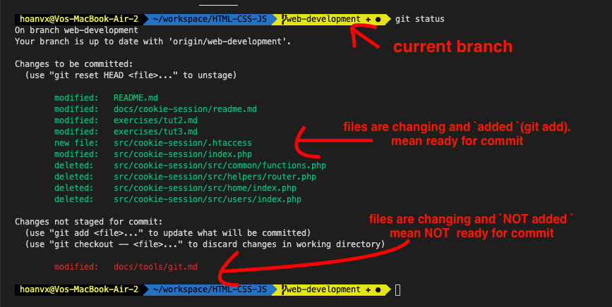
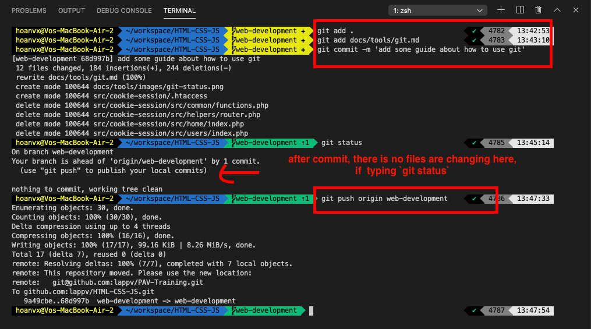
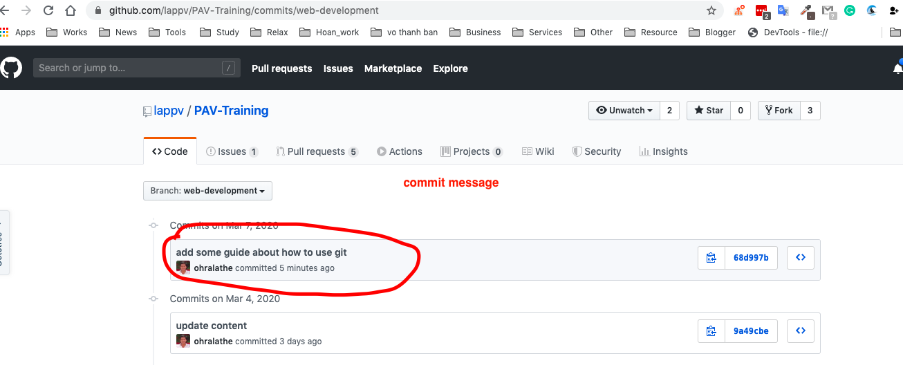

# Overview
In Software developmenent, there are many things to do such as get the requirements from customer, analysts the requirement, coding, test, deploy, etc.

Each phrase, you need to do it. for instance, you may need the microsft office (words, execel) to note the requirement from the customer and transfer that document to develop team.

In coding phrase, to easier in coding and develop fast, support debugger, etc, you may have a good editor, for example, if you are PHP develop, you may need `PHP Storm` or `Visual studio code`.

And to save your source code and manage the source was contribute from other team member. `git` is a good choice. In the past, `SVN` is famouse, but now, it's `git`.

This section will introduce you about some common tools and some basic knowledge about tools using for development.


# Tools
## 1. Git
### 1.1 What is git?
Git is `version control system`. It's free and open source. Git supplies you an easy way to manage the verion of your source code.

### 1.2 Why git?
- Save your source code safe.
- Git small and fast. [Benchmarks here](https://git-scm.com/about/small-and-fast)
- Easier when you want to revert previouse code version
- Resolve the conflict easier


### 1.3 How to use.
I will introduce to you some basic and ussually to use when you are working.

**1.3.1  Install Git.**

If you are using Mac, ealier version, `git` may be installed by default.

if you are using windows OS, you can download and install git [here](https://git-scm.com/downloads). Just one click.

1.3.2. Create a git repository.
There are many git services that was implemented from `git` and allow you use without fee (free) such as [GitHub](https://github.com), [GitLab](https://gitlab.com), [Atlassian](https://www.atlassian.com/git)

In this one, I use Github to make example. To know how to create a GitHub repo, check previouse section HTML-CSS-JS at item [1.1 Prepare your project](./../../exercises/tut1.md#11-prepare-your-project)

**1.3.3. Use some basic commands**
- Create branch
```sh
# way 1
git branch your-branch-name

# a new branch <your-branch-name> was created and cloned from current branch and current branch will not switch to new branch


# way 2
git checkout -b your-branch-name

# similar way 1, but it switch to new branch <your-branch-name>
```

**Example:**
```sh
--------- master            # step1. your current branch here
    |                       # step2. git checkout -b branch-1
    | (cloned)
    ----------- branch-1    # step3. now your current branch is branch-1

```

- List all branch at the local

```sh

git branch [option]  # option means can have or not

# offen usage: -v: get more info about last commit and message
# -r: list remote branch

```

> every command, you can add `--help` to get more explain
> example: `check git branch --help`

- View what files are changing
```sh
git status
```
Example:


- `add` (like save a MS Word file you are editting) files are changing and `commit` (like close MS word) and `push` your file to remote repository (on the cloud)
```sh
git add [path-to-file]  # syntax

# ex:
git add . # . mean all files
git add docs/tools/git.md # specific files, each file separate by a space

git commit -m 'your commit message'

# ex:
git commit -m 'add some guide about how to use git'

git push <remote name> <current-branch-name>

# ex:
git push origin web-development

```
example:


After push to remote repository, your update now saved on the cloud (Github) and that content be safe now.



- Switch branch
```sh
git checkout <branch you want to switch to>

#ex:
git checkout master
```

- Merge content:
```sh
# WAY 1
git merge <branch name> # merge the content from <branch name> into current branch you are staying

# ex, current branch is web-development
git merge master # merge all content of master branch to web-development branch


# WAY 2
git rebase <branch name> # also merge the content from <branch name> to current branch. But it's implement as differnt strategy.

# ex, current branch is web-development
git rebase master.

```

Example about `git merge` and `git rebase`
Below will only explain the `simple scenario` about merge and rebase.

```sh
-------- master
    |      |
    |      |
    -------------- branch-a
           |       (modify and add 1 commit)
           |
           ------- branch-b
                   (modify and add 1 commit)

master (has below commits)
    commit3      2020-01-03
    commit2      2020-01-02
    commit1      2020-01-01


branch-a (has below commits)
    commit4      2020-01-04         # new commit of web-development
    commit3      2020-01-03
    commit2      2020-01-02
    commit1      2020-01-01


branch-b (has below commits)
    commit5      2020-01-05         # new commit of branch-b
    commit3      2020-01-03
    commit2      2020-01-02
    commit1      2020-01-01


# current branch is `master`
git merge branch-b

now `commit5` of branch-b will be clone to new one (same content but different commit id) and copied to master branch

master (has below commits)
    commit5      2020-01-05         # commit copied from branch-b. the copied commit will placed at the top
    commit3      2020-01-03
    commit2      2020-01-02
    commit1      2020-01-01


# because master has new commit, now you want to sync master branch to branch-a to prevent mismatch or out of date.
# current branch is `branch-a`
git rebase master

now `commit5` of master branch will copied (same commit id) to branch-a and place at the bottom of current change (commits) of this branch
branch-a (has below commits)
    commit4      2020-01-04         # new commit of web-development
    commit5      2020-01-05         # commit was rebased from master
    commit3      2020-01-03
    commit2      2020-01-02
    commit1      2020-01-01
```

- Remove files added to git.

  Sometimes, you committed unexpected files to git, so to remove it out of git (but it's still exist your directory), use this command
```sh
git rm --cached <path to file> # you can add -r if path is a directory and you want to remove all files in that directory

```
And mores command often using
- [Git add](https://git-scm.com/docs/git-add)
- [Git commit](https://git-scm.com/docs/git-commit)
- [Git cherry-pick](https://git-scm.com/docs/git-cherry-pick)
- [Git push](https://git-scm.com/docs/git-push)
- [Git merge](https://git-scm.com/docs/git-merge)
- [Git rebase](https://git-scm.com/docs/git-rebase)
- [Git reset](https://git-scm.com/docs/git-reset)
- [Git log](https://git-scm.com/docs/git-log)
- [Git remote](https://git-scm.com/docs/git-remote)
- [Git init](https://git-scm.com/docs/git-init)
- [Git config](https://git-scm.com/docs/git-config)


> **Reference:**
- [basic overview](https://levelup.gitconnected.com/what-is-git-how-to-use-it-why-to-use-it-explained-in-depth-76a5066abaaa)


## 2. Basic linux commands
This is a good article teach you about how to use 37 common command lines in linux (same for OSX, unix)

[Check tutorial here](https://www.howtogeek.com/412055/37-important-linux-commands-you-should-know/)


## 3. Others
### 3.1 Understand about permision, kill process, ports
- [File permission](https://www.linux.com/tutorials/understanding-linux-file-permissions/)
- [Process](https://devconnected.com/understanding-processes-on-linux/)
- [Ports](http://www.linuxandubuntu.com/home/what-are-ports-how-to-find-open-ports-in-linux)


### 3.2 Some ways to set environements and its scope.
- [Linux environment variable step-by-step](https://likegeeks.com/linux-environment-variables/)