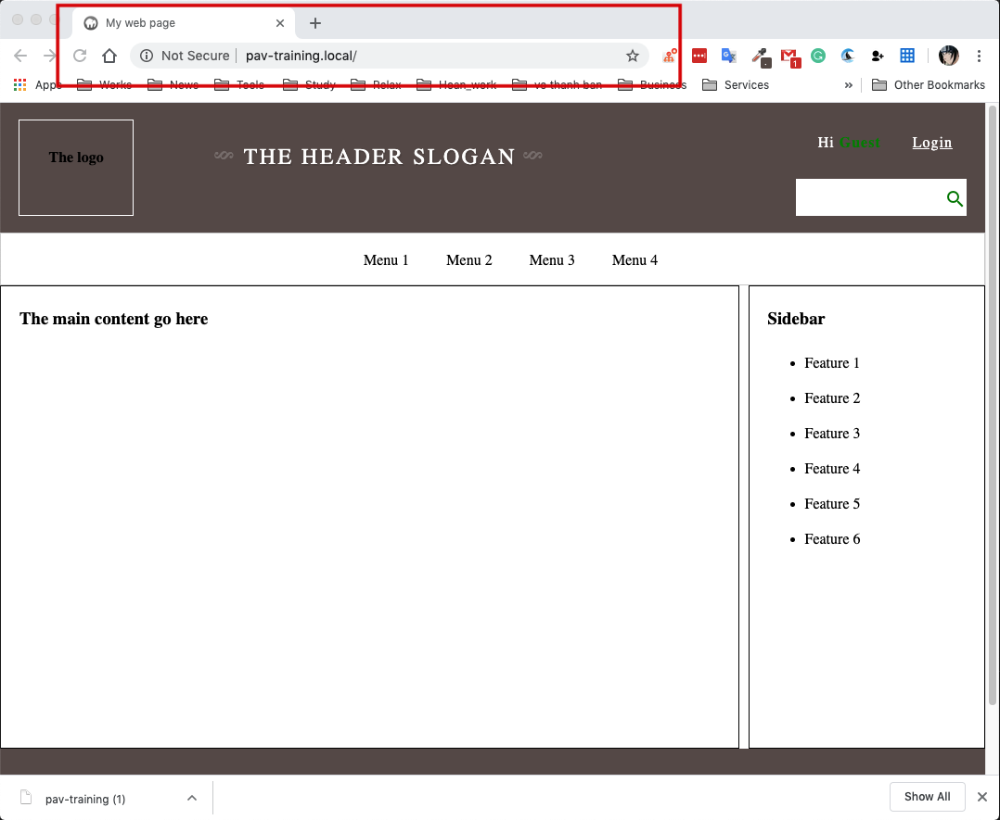
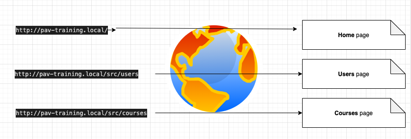
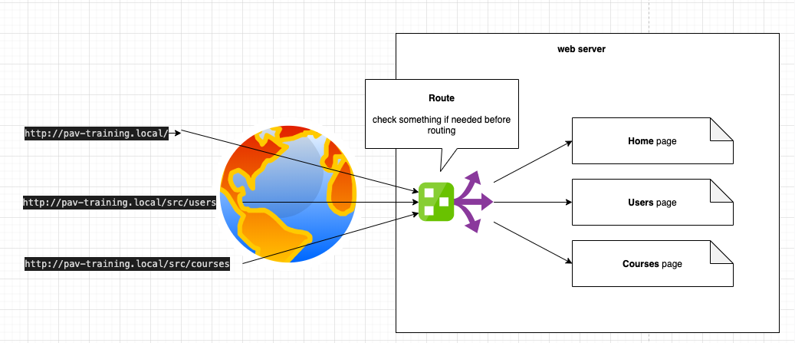

# Build a web server and using the Cookie and Session

## Precondition
1. You have to finish previous section [1. HTML, CSS and JavaScript](./../docs/html-cs-js/readme.md). Because in this exercise, you have to reuse that layout.


> Please try by yourself first before you reference the source code.
> Reference previouse exercise results [here](../src/html-css-js/exercises-2)

# Build web server.
As you know, the session was store at the server side. So to know how session works, we have to build a server.

In this case, I'm using PHP server to because you are studing PHP too.

## Install PHP environment for development
To easier for setting up, you can install [XAMPP](https://www.apachefriends.org/download.html). It's containing `A`pache, `M`ariaDB and `P`HP just 1 click.

> You can find another `combo` like [AMPP](http://ampps.com/downloads), [MAMP](https://www.mamp.info/en/downloads/), LAMP, etc

## Build a login page and use the session to keep the login information.

1. Create a directory to host our web application.

```sh
cd /Applications/MAMP/htdocs
mkdir pav-training

# Create and copied the content of files from previous exercises to below files
touch index.html
touch index.js
touch index.css

```

> __Note__: I'm using MAPP, basically, MAPP, XAMPP,... have the looks similar, so you can use which one you like.


2. Config virtual host

Virtual host like a Domain Name that you use to access to your website.
For example, instead of enter `localhost/pav-training` to entrance the web, you can enter `pav-training.local` (look similar google.com, right?) or `*.abc` (suffix is anything which you like)

```sh
vi /Applications/MAMP/conf/apache/extra/httpd-vhosts.conf
```


```c
# httpd-vhosts.conf

<VirtualHost *:80>
    ServerAdmin service@pav-training.com
    DocumentRoot "/Applications/MAMP/htdocs/pav-training"
    ServerName pav-training.local
    ErrorLog "logs/pav-training.com.log"
    CustomLog "logs/pav-training.com.log" common
</VirtualHost>

```

- Set virtual domain name for you website
```sh
sudo vi /etc/hosts

# Add below content to the host file

127.0.0.1   pav-training.local
```

Now, save all your config and restart the Apache server, restart by MAMP Application or run below command

```sh
# stop
/Applications/MAMP/bin/stopMysql.sh
/Applications/MAMP/bin/stopApache.sh

# start
/Applications/MAMP/bin/startMysql.sh
/Applications/MAMP/bin/startApache.sh
```

Now, open browser and try: `http://pav-training.local`
Your previouse web page was now render from server (server render)



> **Note:**
>
> In previous homeworks, I have been re-structured the project structure as below:
>
>
```php
pav-training
--- src
------ /home
         | index.php  // renamed index.html -> index.php
------ /users
         | index.php // contain the layout and content of users
------ /courses
         | index.php // contain the layout and content of courses
------ /trainers
         | index.php // contain the layout and content of trainers
------ /helpers
         | route.php
------ index.css
------ index.js
```

If you want, you can also re-structure again too. Because in the real project, there are many pages, so if you place in the same directory. it's hard to manage and enhance.

Now, I assume that if the user does not loggin yet, they can only view the home page. Another page will not able to access.

But, we still not implement the `login` function and use the `session` to prevent that. So that, you can access to the other pages like.

```
http://pav-training.local/
http://pav-training.local/src/users
http://pav-training.local/src/courses
...
```

You know the issue if the user do not login but can view any info that you do not allow, right?

3. Setting the `Route` for your web application.

If you are using the framework for you web page such as: [Spring](https://spring.io/projects/spring-framework), [ASP.net](https://dotnet.microsoft.com/apps/aspnet), [Angular](http://angular.io/), ... they have already implemented the route for you.

**So why we need the Route?**
Imagine, if there is no route by you or framework, every your request will be dispatch directy to the page (image below)



As above image, if you want to check whether the user logged in or not to allow access or not. `You have to check 3 times` at 3 pages (home, users, and courses), right?

And by default, Apache let you access to the right page with the right directory structure http://pav-training.local`/src/users/index.php`.

This is not good because the user know how you struct you file and your directory.

To solve this problem, we create a route class, and each request from users will go to this Route engine first before forward to other pages.



3.1 Create the route engine.
This class allow you add the sub uri need to be routed.
```php
// src/helpers/route.php
<?php
class Route {
    private static $routes = Array();
    private static $pathNotFound = null;
    private static $methodNotAllowed = null;

    public static function add($expression, $function, $method = 'get'){
      array_push(self::$routes, Array(
        'expression' => $expression,
        'function' => $function,
        'method' => $method
      ));
    }

    public static function pathNotFound($function){
      self::$pathNotFound = $function;
    }

    public static function methodNotAllowed($function){
      self::$methodNotAllowed = $function;
    }

    public static function run($basepath = '/') {
      // Parse current url, parse uri
      $parsed_url = parse_url($_SERVER['REQUEST_URI']);

      if(isset($parsed_url['path'])) {
        $path = $parsed_url['path'];
      } else {
        $path = '/';
      }

      // Get current request method
      $method = $_SERVER['REQUEST_METHOD'];

      $path_match_found = false;

      $route_match_found = false;

      foreach(self::$routes as $route) {
        // If the method matches check the path

        // Add basepath to matching string
        if($basepath != '' && $basepath != '/') {
          $route['expression'] = '(' . $basepath . ')' . $route['expression'];
        }

        // Add 'find string start' automatically
        $route['expression'] = '^' . $route['expression'];

        // Add 'find string end' automatically
        $route['expression'] = $route['expression'] . '$';

        // echo $route['expression'].'<br/>';

        // Check path match
        if(preg_match('#' . $route['expression'] . '#', $path, $matches)){

          $path_match_found = true;

          // Check method match
          if(strtolower($method) == strtolower($route['method'])) {
            // Always remove first element. This contains the whole string
            array_shift($matches);

            if($basepath!='' && $basepath != '/') {
              // Remove basepath
              array_shift($matches);
            }

            call_user_func_array($route['function'], $matches);

            $route_match_found = true;

            // Do not check other routes
            break;
          }
        }
      }

      // No matching route was found
      if(!$route_match_found) {
        // But a matching path exists
        if($path_match_found){
          header("HTTP/1.0 405 Method Not Allowed");

          if(self::$methodNotAllowed) {
            call_user_func_array(self::$methodNotAllowed, Array($path, $method));
          }
        } else {
          header("HTTP/1.0 404 Not Found");

          if(self::$pathNotFound){
            call_user_func_array(self::$pathNotFound, Array($path));
          }
        }
      }
    }

  }

```

Then, setting you application route path

```php
// index.php (at root folder)

// Add base route (home page)
Route::add('/', function() { include 'src/home/index.php'; });

Route::add('/home', function() { include 'src/home/index.php'; });

Route::add('/users', function() { include 'src/users/index.php'; });

// start the route.
Route::run('/');
```
But by default, Apache will navigate the user request mapping to project folder.
example.

| No | Request url                   | Directory is mapping          |
| - | ------------                  | -----------------             |
| 1 | pav-training.local/           |     => / index.php             |
| 2 | pav-training.local/home       |     => /home/index.php     |
| 3 | pav-training.local/users      |     => /users/index.php     |
| 4 | pav-training.local/users/add  |     => /users/add/index.php     |

So, you Route config will not work perfectly. It just run into you route configuration if user enter the url like No.1

To fix this issue, I have config to let Apache always forward the request from user to the index.php in root directory.

To do so, create `.htaccess` file at the root directory and put below content:
```conf
# .htaccess

DirectoryIndex index.php

# Enable apache rewrite engine
RewriteEngine on

# Set your rewrite base
# Edit this in your init method too if you script lives in a subfolder
RewriteBase /

# Deliver the folder or file directly if it exists on the server
RewriteCond %{REQUEST_FILENAME} !-f
RewriteCond %{REQUEST_FILENAME} !-d

# Push every request to index.php
RewriteRule ^(.*)$ index.php [QSA]
```

Don't know what is [.htaccess? Check here](http://www.htaccess-guide.com/) or [here](https://stackoverflow.com/questions/13170819/what-is-htaccess-file)

3.2 Implement login
To check if the user is not log in yet, then does not allow user view other pages.Before forward to any page, place you check logic a and redirect to the home page if they are not logged in.

```php
// index.php

require 'src/helpers/router.php';

// must have, if you are using session
session_start();

$parsed_url = parse_url($_SERVER['REQUEST_URI']);

if (!isset($_SESSION['LOGGED_IN']) && $parsed_url['path'] != '/') {
    header("Location: /");
    die();
}

// Add base route (startpage)
Route::add('/', function() { include 'src/home/index.php'; });

// ...

```

### Review
- [Php Session](https://www.w3schools.com/php/php_sessions.asp)
- 