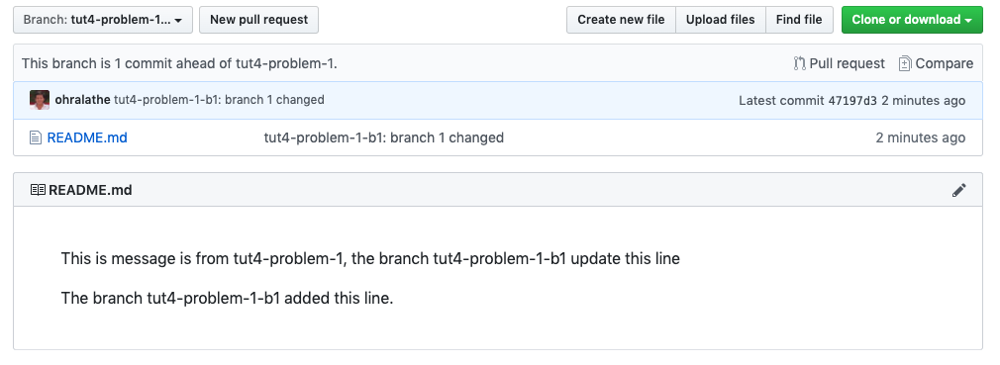
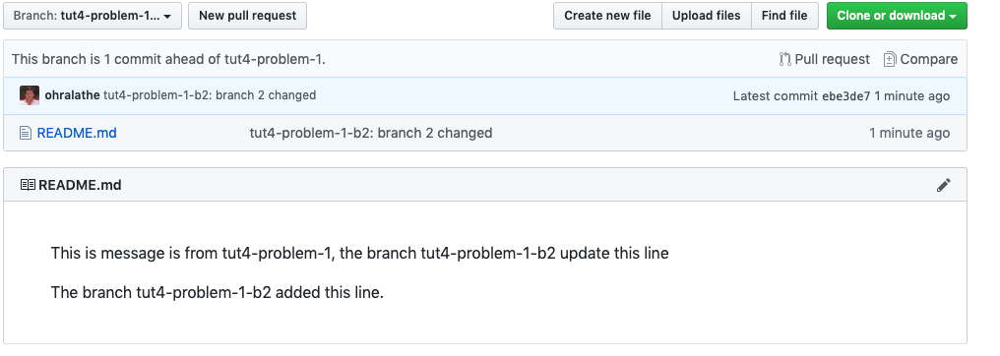
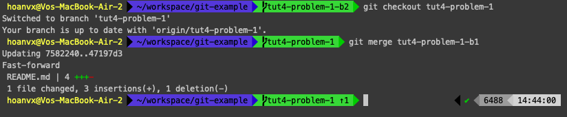
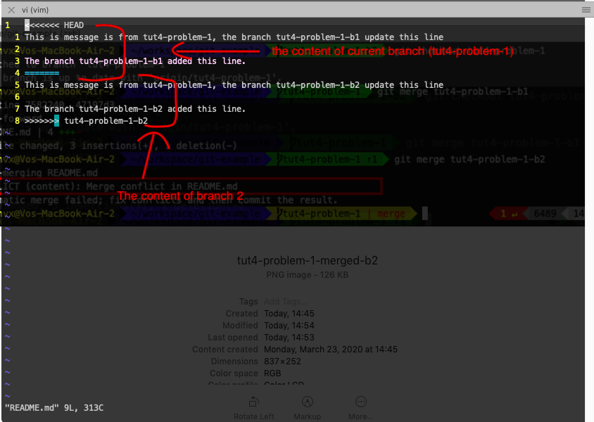
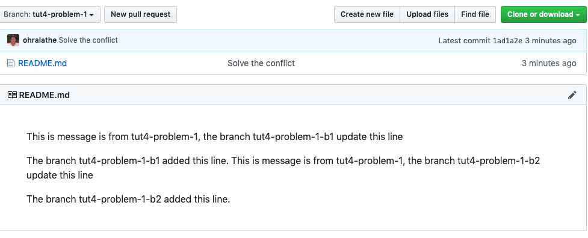
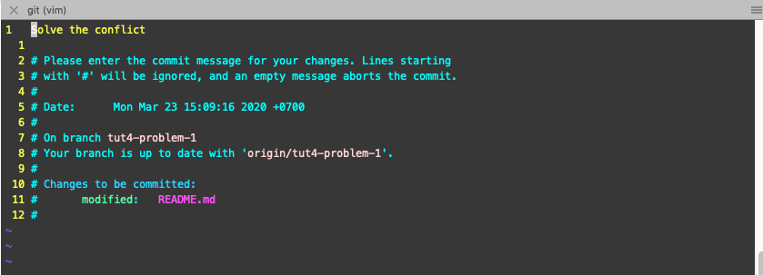

# Exercise

## Problem 1
You do not how use git to manage your source code by command line such add.
- solve the conflict.
- change commit messages
- delete local / remote brach
- Revert to previous version (previous commit)

## Solution
Here I use repo `git@github.com:ohralathe/git-example.git` was created from previous section.

Now, start cloning the sample project and do it.
```sh
cd ~/workspace
git clone git@github.com:ohralathe/git-example.git

cd git-example
git checkout -b tut4-problem-1

# add new README.md
echo 'This is message is from tut4-problem-1' > README.md

# push this file to remote repo.

git add .   # add all files in the repo
git commit -m 'File Readme.md will be added'
git push origin tut4-problem-1
```

### 1. Solve the conflict
When the conflict occurs?

The conflict occurs when a line of a file have 2 updated from 2 difference branches.

Now, We will create 2 branch and make a change on the same line of the file to make the conflict.

- Create branch 1: `tut4-problem-1-b1`
```sh
# Current branch tut4-problem-1

git checkout -b tut4-problem-1-b1

```

Change the content of file  README.md from
```txt
This is message is from tut4-problem-1
```

to 
```
This is message is from tut4-problem-1, the branch tut4-problem-1-b1 update this line

The branch tut4-problem-1-b1 added this line.
```

- Create branch 1: `tut4-problem-1-b2`
```sh
# Current branch tut4-problem-1

git checkout -b tut4-problem-1-b2
```

Change the content of file  README.md from
```txt
This is message is from tut4-problem-1
```

to 
```
This is message is from tut4-problem-1, the branch tut4-problem-1-b2 update this line

The branch tut4-problem-1-b2 added this line.
```

After done above steps, your result like this:




Next, merge the content of `tut4-problem-1-b1` to `tut4-problem-1`. Follow the command in the image


Next, merge the content of `tut4-problem-1-b2` to `tut4-problem-1`


The conflict occured, now let solve the conlict.

open file and update the content again
```sh
vi README.md
```


As above conflict, depend on your spec, you can resolve base on below way

- if you want the content from `tut4-problem-1-b2` is latest, you will remove the line: 1 -> 4 and line 8
  
  ```sh
  <<<<<<< HEAD
  ....
  =======

  # and remove this line
  >>>>>>>> tut4-problem-1-b2
  ```

- if you want the content from `tut4-problem-1-b1` is latest, you will remove lines: 1 and 4 -> 8
  ```sh
  <<<<<<< HEAD
  ....
  =======

  # and remove this line
  >>>>>>>> tut4-problem-1-b2
  ```

- if you want to keep content of both, just remove line 1, 4 and 8.

In this one, I will keep both content. After solve the conflict, type below command to completely solve it.

```sh
git add README.md
git commit -m 'Solved the conflict`
git push origin tut4-problem-1
```

The result like


### 2. Change commit messages
Sometimes, you have commit but you realized that the commit message is not suitable and you want to change it.

Here is how to do it

```sh
# current branch tut4-problem-1
git commit --amend

# press `i` to enter edit mode and change the message content. (using like vim)
git push origin tut4-problem-1 -f # add -f to force push, because you need to override previous commit id.

```


### 3. Delete local / remote brach
After long time working, you will have many branches at the local.
To save disk space, you should delete unused branch

```sh
# show all local branch
git branch -v

# Delete branch syntax
git branch -D <branch-name>

# ex
git branch -D tut4-problem-1-b1
```

### 4. Revert to previous version (previous commit)

Sometimes, you need to revert previous version because some of reason such as you be requested to develop the feature A for testing something, but after using, your users does not like it, and the product owner want to  revert previous version.

Instead of removing the current source change and replace by the old source code one, You can revert it easily by git.

```sh
# synctax
git reset --hard <the-commit-id>

# ex
git reset --hard 9a49cbe

# to get the commit ID, you can use `git log`
```

___
## Problem 2.
I'm working with a project with many repositories. So every morning, I need to pull the latest code from the master after booting my laptop to prevent out of date when I am updating something.

Assume that I'm working on these repos [material](https://github.com/angular/material), [rxjs](https://github.com/ReactiveX/rxjs), [libimobiledevice](https://github.com/libimobiledevice/libimobiledevice) and [ansible](https://github.com/ansible/ansible)

## Solution
- write a script to do all my common tasks and allow it to run at the startup time.

## How
1. Structure folder and Fetch all repos
```sh
# create workspace directory
mkdir ~/workspace

cd ~/workspace

git clone git@github.com:angular/material.git
git clone git@github.com:ReactiveX/rxjs.git
git clone git@github.com:libimobiledevice/libimobiledevice.git
git clone git@github.com:ansible/ansible.git

```

now in workspace, you have 4 project folders `material`, `jxjs`, `libimobiledevice` and `ansible`
```sh
cd ~/workspace
ls -la # check current directories
```

next, create a script named `fetch-repos.sh` in workspace,

Assume that:
-  `master` is the main branch that the team is working on.
-  There is no change in your repo (your current change has been commit)

```sh
# ~/workspace/fetch-repos.sh
cd ~/workspace # change working directory
touch fetch-repos.sh # create a empty file
vi fetch-repos.sh # open file fetch-repos.sh to edit and press `i` to enter edit mode

# input below command in fetch-repos.sh file.
cd ~/workspace
cd material
git checkout master
git pull origin master

cd ..    # back to workspace directory
cd rxjs  # go to rxjs directory
git checkout master
git pull origin master

cd ../libimobiledevice  # go to libimobiledevice directory
git checkout master
git pull origin master

cd ../ansible  # go to libimobiledevice directory
git checkout master
git pull origin master

# After done your input, press: `esc` then pres `:`  + `x` to save and quite fetch-repos.sh file

```

Try to run `fetch-repos.sh`
```sh
cd ~/workspace
./fetch-repos.sh
```

What is the result? You cannot run that file? Why is that? What is the message?

// you message like this?
```txt
permission denied:
```

It's because the `fetch-repos.sh` does not have the execute permission. So, set the execute permission for it.
```sh
cd ~/workspace
chmode +x `fetch-repos.sh` # add execute permission
```

Now try again. Is it run okay?


# Homeworks
1. (Easy: 10 min) create a bash file that print some content (example hello world!).
   Set its permission to able to execute (execute permission, do not use +x as above)
2. (Easy: 30 min) Using commands
   - Open your Visual Studio Code and use kill command to kill it
   - create below directory from your home directoy `~/tmp/tmp1/tmp2/tmp3/tmp4/tmp5` (just use only 1 command and use 1 times to create all folder)
   - Rename directory `tmp3` to `tmp3-sub`
   - restart your computer
   - create a zip file for folder `tmp2`
   - create tar file for folder `tmp3`
   - create a custom command `ll` to do the task similar with `ls -la`. It means, when I input `ll` and enter in the termial window, the result is the same when i enter `ls -la`. (Remember, Just setup 1 time, and you can do it everytime when open the termial window)
   - create a file in `~/tmp/test.txt` and put below content inside test.txt by `just 1 command and 1 time`

  `If the first character is a - the item is a file, if it is a d the item is a directory. The rest of the string is three sets of three characters. From the left, the first three represent the file permissions of the owner, the middle three represent the file permissions of the group and the rightmost three characters represent the permissions for others. In each set, an r stands for read, a w stands for write, and an x stands for execute.`

- (Easy: 10 min) Find the word `character` in test.txt file.
- (Medium: 15 min) Print to console (terminal console) the Count of the `character`, how many words Occurrences
- (Hard: 1hour): Refactor above exercise and put all your repos to an array and then loop through that array, then fetch each repo
