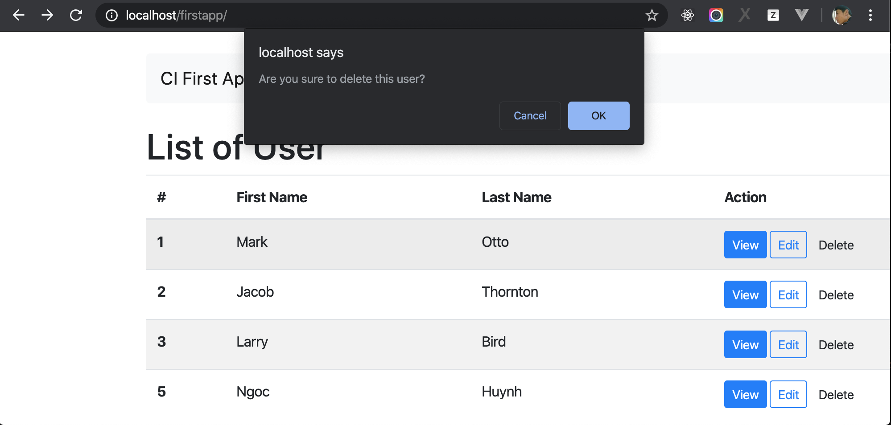

# Delete an User

In this chapter, we will implement feature to delete an user.


Look at index page above, imagine that when you click on the button `Delete`, an message will be shown to confirm that you realy want to delete an user or not. If you click `OK`, user will be deleted, if click `Cancel`, do nothing.

Same with create and update user, we need to implement Model and Controller for this feature.

## Add method delete to User Model

Open User Model `application/models/Users_model.php` and add flowing method

```php
public function delete_user($user_id)
{
    return $this->db->where('id', $user_id)->delete('users');
}
```

The souce code `$this->db->where('id', $user_id)->delete('users');` generates and excutes the query below to delete data:

```SQL
DELETE FROM users WHERE id = $user_id
```

You can check more [Query Builder to delete data here](https://codeigniter.com/user_guide/database/query_builder.html#deleting-data)


## Add method delete to User Controller

Open User Controller `application/controllers/Users.php` and add `delete` method

```php
public function delete($user_id)
{
    $this->users_model->delete_user($user_id);
    redirect(base_url('/'));
}
```

## Update button delete User


As we reminded above about delete button. When user click on `Delete`, a Dialog box with message `Are you sure to delete this user?` will be shown as below. And if user click `OK`, delete the user, if user click `Cancel`, do nothing.




The way to implement it very simple, open `application/views/users/index.php` and find

```html
<button class="btn btn-sm">Delete</button>
```

replace ablove line by

```php
<a onclick="return confirm('Are you sure to delete this user?')" href="<?php echo site_url("users/delete/$user[id]"); ?>"><button class="btn btn-sm">Delete</button></a>
```

If you can't understand `return confirm('Are you sure to delete this user?')`, learn more about function `confirm` [here](https://www.w3schools.com/jsref/met_win_confirm.asp)


Now, open http://localhost/firstapp/ and click `Delete`, the user will be deleted from Users List.

## Conclusion

After this chapter, you have basic knowledge in CodeIgniter, you can get more detail at:

- [General Topics](https://codeigniter.com/user_guide/general/index.html)
- [Libraries](https://codeigniter.com/user_guide/libraries/index.html)
- [Database](https://codeigniter.com/user_guide/database/index.html)
- [Helpers](https://codeigniter.com/user_guide/helpers/index.html)

