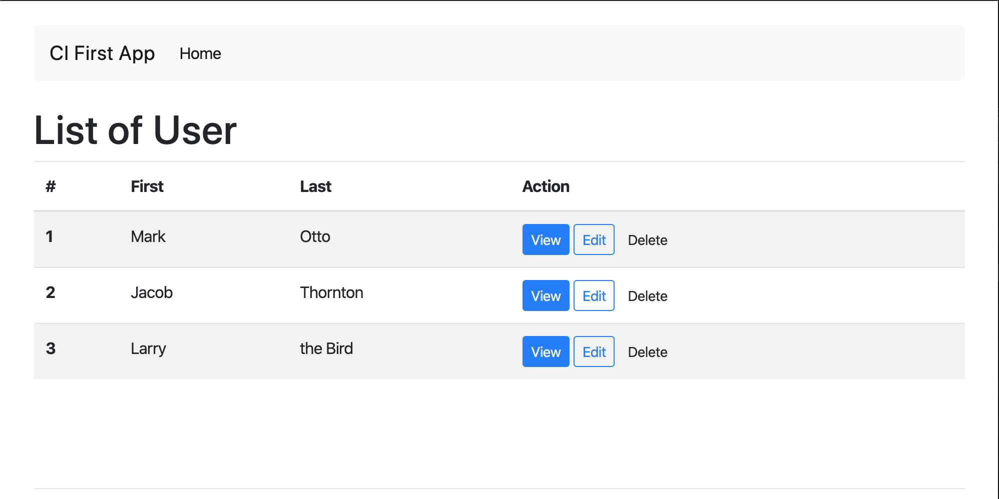
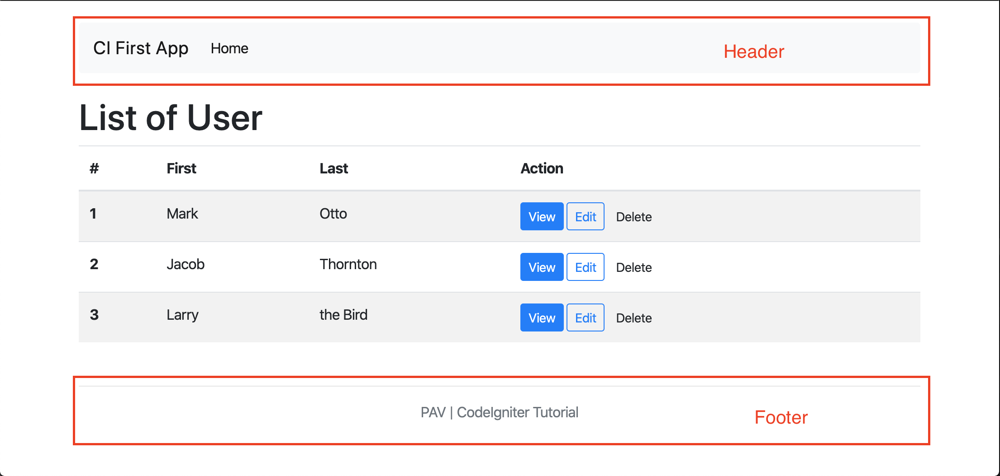
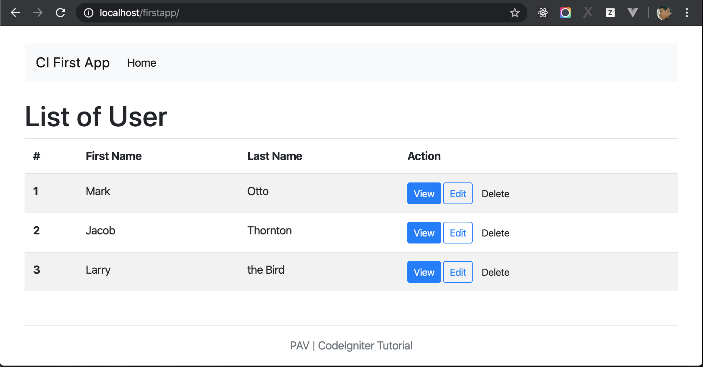

# Create Index Page

Before begin to implement pages, let create a new git branch:

```bash
$ git checkout -b curd
```

## 1. Create Static Page for List Of User

The first thing you’re going to do is set up a controller to handle static pages. A controller is simply a class that helps delegate work. It is the glue of your web application.

For example, when you access to the URL http://localhost/firstapp, you will get the website




### 1.1 Create Controller

We need to create a Controller for handle request, let create a file at `application/controllers/Users.php` with the following code.

```php
<?php
class Users extends CI_Controller {

    public function index()
    {
      
    }
}
```

### 1.2 Configuration routing

And update the `router` config to map url `http://localhost/firstapp` with above Controller by open file `application/config/routes.php`, and go to line number 52, you will see the code:

```php
$route['default_controller'] = 'welcome';
```

Replace above line by 

```php
$route['default_controller'] = 'users';
```

Try to access the URL http://localhost/firstapp again, you will see a blank page. But don't worry, wi'll continue next steps.

### 1.3 Create View

**Note: because you learned HTML, CSS and Javascript in other parts, so we don't explain them here, let focus on how CodeIgniter work**



Take a look on above screen shot, there are 2 pars: Header and Footer and `List Of User`. Header & Footer will be used in other pages, so that, we'll separate HTML code of Header and Footer by creating 2 files

Create header file at `application/views/header.php`

```php
<!doctype html>
<html lang="en" class="h-100">
  <head>
    <!-- Required meta tags -->
    <meta charset="utf-8">
    <meta name="viewport" content="width=device-width, initial-scale=1, shrink-to-fit=no">

    <!-- Bootstrap CSS -->
    <link rel="stylesheet" href="assets/css/bootstrap.min.css">
    <link rel="stylesheet" href="assets/css/style.css">

    <title>List of Users</title>
   
  </head>
  <body class="d-flex flex-column h-100">
    
    <div class="container pt-4 pb-4">
        <nav class="navbar navbar-expand-lg navbar-light bg-light rounded">
            <a class="navbar-brand" href="#">CI First App</a>
            <button class="navbar-toggler" type="button" data-toggle="collapse" data-target="#navbarsExample09" aria-controls="navbarsExample09" aria-expanded="false" aria-label="Toggle navigation">
                <span class="navbar-toggler-icon"></span>
            </button>
    
            <div class="collapse navbar-collapse" id="navbarsExample09">
                <ul class="navbar-nav mr-auto">
                    <li class="nav-item active">
                        <a class="nav-link" href="/">Home <span class="sr-only">(current)</span></a>
                    </li>
                </ul>
            </div>
        </nav>
    </div>
```

Create footer file at `application/views/footer.php`

```php
<footer class="footer mt-auto py-3">
        <div class="container pb-5">
            <hr>
            <span class="text-muted">
                PAV | CodeIgniter Tutorial
            </span>
        </div>
    </footer>

    
    <script src="assets/js/jquery-3.3.1.slim.min.js"></script>
    <script src="assets/js/popper.min.js"></script>
    <script src="assets/js/bootstrap.min.js"></script>
  </body>
</html>
```

And next is main task, create a `view` to show List Of Users by creating file `application/views/users/index.php`

```php
<main role="main" class="flex-shrink-0">
  <div class="container">
      <h1>List of User</h1>
      <table class="table table-striped table-hover">
          <thead>
              <tr>
              <th scope="col">#</th>
              <th scope="col">First Name</th>
              <th scope="col">Last Name</th>
              <th scope="col">Action</th>
              </tr>
          </thead>
          <tbody>
              <tr>
              <th scope="row">1</th>
              <td>Mark</td>
              <td>Otto</td>
              <td>
                  <a href="#"><button class="btn btn-primary btn-sm">View</button></a>
                  <a href="#"><button class="btn btn-outline-primary btn-sm">Edit</button></a>
                  <button class="btn btn-sm">Delete</button>
              </td>
              </tr>
              <tr>
              <th scope="row">2</th>
              <td>Jacob</td>
              <td>Thornton</td>
              <td>
                  <a href="#"><button class="btn btn-primary btn-sm">View</button></a>
                  <a href="#"><button class="btn btn-outline-primary btn-sm">Edit</button></a>
                  <button class="btn btn-sm">Delete</button>
              </td>
              </tr>
              <tr>
              <th scope="row">3</th>
              <td>Larry</td>
              <td>the Bird</td>
              <td>
                  <a href="#"><button class="btn btn-primary btn-sm">View</button></a>
                  <a href="#"><button class="btn btn-outline-primary btn-sm">Edit</button></a>
                  <button class="btn btn-sm">Delete</button>
              </td>
              </tr>
          </tbody>
      </table>
  </div>
</main>

```

Now, we already implemenmented routing, Controller and Views (header, footer and index). Next step we'll implement Controller logic to show views on screen.

### 1.4 Implement Logic for Users Controller to show index page

Open file `application/controllers/Users.php`, and update by flowing source code

```php
<?php
class Users extends CI_Controller {

    public function index()
    {
        // Load header view
        $this->load->view('header'); 

        // Load index (List of Users) view
        $this->load->view('users/index');

        // Load footer view
        $this->load->view('footer');
    }
}

```

Access http://localhost/firstapp/ again to see the result



## 2. Load Users List from Database

Note: if you still didn't learn Database part, you need to learn it before continue

### 2.0 Create database

First, Create a database name `ci_firstapp`, after that execute below query to create table `users` and insert data

```SQL
DROP TABLE IF EXISTS `users`;

CREATE TABLE `users` (
  `id` int(11) unsigned NOT NULL AUTO_INCREMENT,
  `first_name` varchar(50) DEFAULT NULL,
  `last_name` varchar(50) DEFAULT NULL,
  `email` varchar(255) DEFAULT NULL,
  PRIMARY KEY (`id`)
) ENGINE=InnoDB DEFAULT CHARSET=utf8;

LOCK TABLES `users` WRITE;
/*!40000 ALTER TABLE `users` DISABLE KEYS */;

INSERT INTO `users` (`id`, `first_name`, `last_name`, `email`)
VALUES
	(1,'Mark','Otto','mark.otto@email.com'),
	(2,'Jacob','Thornton','jacob.t@email.com'),
	(3,'Larry','Bird','larry.bird@email.com');

/*!40000 ALTER TABLE `users` ENABLE KEYS */;
UNLOCK TABLES;
```

### 2.1 Config Database Connection for CodeIgniter

You need to DB connection for CodeIgniter app, open file `application/config/database.php`

```php
$db['default'] = array(
	'dsn'	=> '',
	'hostname' => 'localhost',
	'username' => '',
	'password' => '',
	'database' => '',
	'dbdriver' => 'mysqli',
	'dbprefix' => '',
	'pconnect' => FALSE,
	'db_debug' => (ENVIRONMENT !== 'production'),
	'cache_on' => FALSE,
	'cachedir' => '',
	'char_set' => 'utf8',
	'dbcollat' => 'utf8_general_ci',
	'swap_pre' => '',
	'encrypt' => FALSE,
	'compress' => FALSE,
	'stricton' => FALSE,
	'failover' => array(),
	'save_queries' => TRUE
);
```

And update:

```
'hostname' => 'YOUR DB HOST NAME'
'username' => 'YOUR DB USER NAME',
'password' => 'YOUR DB PASSWORD',
'database' => 'YOUR DB NAME',
```

### 2.2 Setting up User model

Instead of writing database operations right in the controller, queries should be placed in a model, so they can easily be reused later. Models are the place where you retrieve, insert, and update information in your database or other data stores. They represent your data.

Create User model file at `application/models/Users_model.php` and add below source code

```php
<?php
class Users_model extends CI_Model {

    public function __construct()
    {
        $this->load->database();
    }
}
```

This code looks similar to the controller code that was used earlier. It creates a new model by extending CI_Model and loads the database library. This will make the database class available through the `$this->db` object.

Now that the database and a model have been set up, you’ll need a method to get all of our users from our database. To do this, the database abstraction layer that is included with CodeIgniter — [Query Builder](https://codeigniter.com/user_guide/database/query_builder.html) — is used. This makes it possible to write your ‘queries’ once and make them work on all supported database systems. Add the following method to Users model.

```php
<?php
public function get_users()
{
    $query = $this->db->get('users');
    return $query->result_array();
}
```

### 2.3 Dislay Users list on view

Now that the queries are written, the model should be tied to the views that are going to display the user items to the user. This could be done in our Users controller created earlier.

Open Users controller file `application/controllers/Users.php` and update flowing source code 

```php
<?php
class Users extends CI_Controller {

    public function __construct()
    {
        parent::__construct();

        // This line will load user model to this controller
        $this->load->model('users_model');
    }

    public function index()
    {
        // Use method get_users of user model to get users list
        $data["users"] = $this->users_model->get_users();

        $this->load->view('header'); 

        // assign users list to view
        $this->load->view('users/index', $data);
        $this->load->view('footer');
    }
}
```

`$this->load->view('users/index', $data);` will assign users list to view by variable named `$users`, now open view `application/views/users/index.php`, and update source code to show users list

```php
<main role="main" class="flex-shrink-0">
  <div class="container">
      <h1>List of User</h1>
      <table class="table table-striped table-hover">
          <thead>
              <tr>
              <th scope="col">#</th>
              <th scope="col">First Name</th>
              <th scope="col">Last Name</th>
              <th scope="col">Action</th>
              </tr>
          </thead>
          <tbody>
              <?php foreach ($users as $user): ?>
                  <tr>
                  <th scope="row"><?php echo $user["id"]; ?></th>
                  <td><?php echo $user["first_name"]; ?></td>
                  <td><?php echo $user["last_name"]; ?></td>
                  <td>
                      <a href="#"><button class="btn btn-primary btn-sm">View</button></a>
                      <a href="#"><button class="btn btn-outline-primary btn-sm">Edit</button></a>
                      <button class="btn btn-sm">Delete</button>
                  </td>
                  </tr>
              <?php endforeach; ?>
          </tbody>
      </table>
  </div>
</main>
```

Access to http://localhost/firstapp/ to check result. 


**Update page title**

Before finish this chapter, open file `application/views/header.php` and fine line:

```HTML
<title>List of Users</title>
```

You will see that Header will be used for other pages, but title is hard code. Make it show dynamically by flowing step:

Open User Controller `application/controllers/Users.php`, and update method `index` by flowing source code:

```php
public function index()
{
    $data["users"] = $this->users_model->get_users();

    // declaring page_title variable
    $data["page_title"] = "List Of Users";

    // Assign page title data to header
    $this->load->view('header', $data); 
    $this->load->view('users/index', $data);
    $this->load->view('footer');
}
```

Open `application/views/header.php` and replace `<title>List of Users</title>` by `<title><?php echo $page_title; ?></title>`


## 3. Conclusion

In this part, we learned:

- Setting default controller
- Database connection configuration
- How to get data from MySQL.
- How is MVC work

Now, go to next chapter: [Create an User](./ci_create.md)
