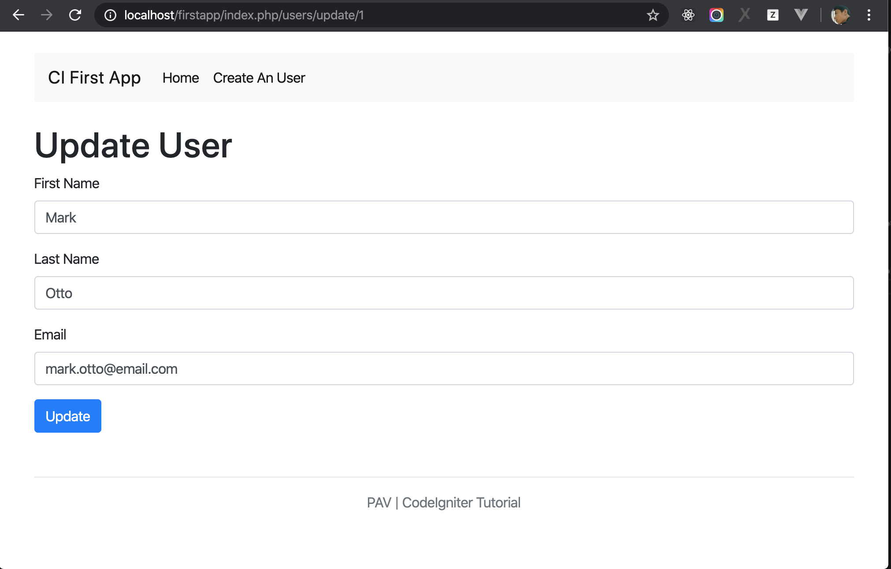

# Update an User

In previous chapter, you learned how to Create an User, in this chapter, you will learn how to update an User.

Updating an User is mostly same with creating an user, by flowing steps:

- Add a method for updating user in User Model
- Add a method for updating user in User Controller
- Create a form (view) to input update User data.

## Add method Update to User Model

Open user model `application/models/Users_model.php` and add method `update` with flowing source code. In this method, we use [Query Builder for Update Data](https://codeigniter.com/user_guide/database/query_builder.html#updating-data).

```php
public function update_user($user_id)
{
    $this->load->helper('url');

    $data = array(
        'first_name' => $this->input->post('first_name'),
        'last_name' => $this->input->post('last_name'),
        'email' => $this->input->post('email')
    );

    $this->db->where('id', $user_id);
    return $this->db->update('users', $data);
}
```

Imagine that you need to show current User data to edit form, therefore you need to make a method `get_user($user_id)` to get User information by user id by add flowing method to User Model

```php
public function get_user($user_id)
{
    $query = $this->db->where('id', $user_id)->get('users');
    return $query->row();
}
```

## Add medthod Update to User Controller

Open User controller `application/controllers/Users.php` and add medthod `update`. This method is almost same with `create`, we only add `$data["user"] = $this->users_model->get_user($user_id);` to get and show current user data to update form.

```php
public function update($user_id)
{
    $this->load->helper('form');
    $this->load->library('form_validation');

    $data["user"] = $this->users_model->get_user($user_id);

    $data["page_title"] = "Update User";
    $this->form_validation->set_rules('first_name', 'First name', 'required');
    $this->form_validation->set_rules('last_name', 'Last name', 'required');
    $this->form_validation->set_rules('email', 'Email', array('required','valid_email'));
    if ($this->form_validation->run() === FALSE) {
        $this->load->view('header', $data); 
        $this->load->view('users/update', $data);
        $this->load->view('footer');
    } else {
        $this->users_model->update_user($user_id);
        redirect(base_url('/'));
    }
}
```

## Create update Form

Create a update form at `application/views/users/update.php`


```php
<main role="main" class="flex-shrink-0">
    <div class="container">
        <h1>Update User</h1>
        <?php echo validation_errors(); ?>

        <?php echo form_open('users/update/' . $user->id); ?>
            <div class="form-group">
                <label for="name">First Name</label>
                <input type="text" class="form-control" name="first_name" id="first_name" value="<?php echo $user->first_name; ?>">
            </div>
            <div class="form-group">
                <label for="last_name">Last Name</label>
                <input type="text" class="form-control" name="last_name" id="last_name" value="<?php echo $user->last_name; ?>">
            </div>
            <div class="form-group">
                <label for="email">Email</label>
                <input type="text" class="form-control" name="email" id="email" value="<?php echo $user->email; ?>">
            </div>
            <button type="submit" class="btn btn-primary">Update</button>
        <?php echo form_close(); ?>
    </div>
</main>
```

This form this also same with `create form`, we only need to the source code like `<?php echo $user->first_name; ?>` to show current user data on the form.


## Make a link to User Update Page

We already implemented Update User function, let make a link to navigate to this page on Users List.

Open `application/views/users/index.php` and update Edit button by find to the line

```html
<a href="#"><button class="btn btn-outline-primary btn-sm">Edit</button></a>
```

and replace by

```php
<a href="<?php echo site_url("users/update/$user[id]"); ?>"><button class="btn btn-outline-primary btn-sm">Edit</button></a>
```

After modified the URL for button Edit, go to http://localhost/firstapp/ and click on button `Edit`, browser will navigate to http://localhost/firstapp/index.php/users/update/1 (1 is user_id, if you clicked on another user, 1 will be replaced by another user id)



Try to change User data like: First Name, Last Name and press button `Update`, and you will see that the User will be updated.

Latest, push your souce code on Github

```bash
$ git add -A
$ git commit -m "update user"
$ git push origin curd
```

## Conclusion

The knowledge in this chapter is almost same with previous chapter (Create an User), but you can learn using Query Builder to update data 


You learned: create, update and list up users. Let go to next chapter to lean how to [Delete an User](./ci_delete.md)
