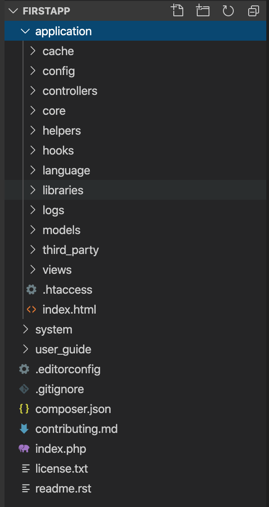
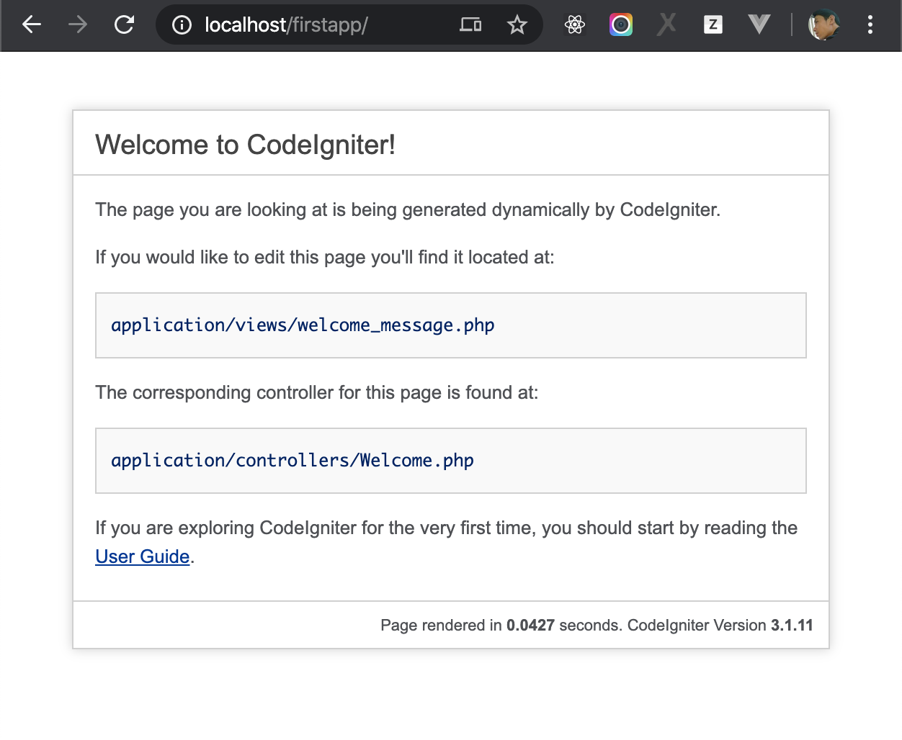
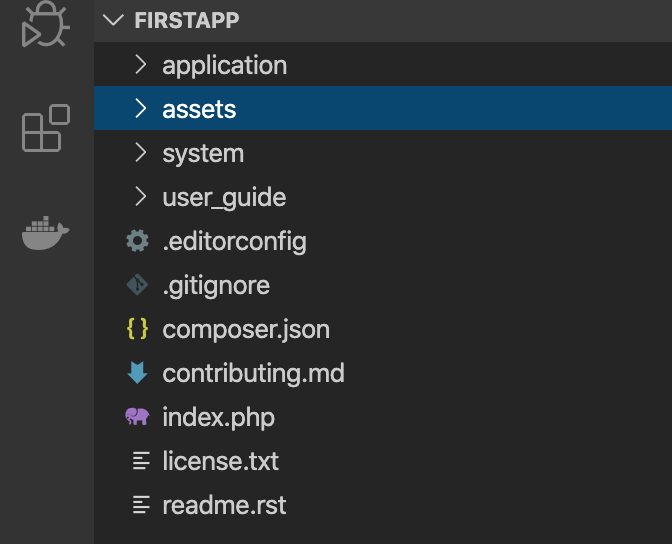

# Install CodeIgniter

Flow below steps to install CodeIgniter Framework.

1. [Dowload CodeIgniter v3.1.11](https://codeigniter.com/user_guide/installation/downloads.html).
2. Unzip the downloaded package, you will be get a folder named `CodeIgniter-3.1.11`
3. Copy unziped folder `CodeIgniter-3.1.11` to your WEBROOT, and rename the folder to `firstapp`

The structure of Folder `firstapp` will be like:



CodeIgniter is installed in your PC, let access the URL http://localhost/firstpp/, you will see the website




## Prepare for next steps

In order to prepare for next step, please so below steps:

- Download the resource at https://drive.google.com/file/d/1apph2qFOIqXQ6LeT80JbSgejGEzcgfd7/view
- Unzip downloaded file, you will get a folder named `assets`, move `assets` to `firstapp/assets`



Before continue, let create a repository on Github named `firstapp`, and push your source code to the repository

```bash
$ git init
$ git add -A
$ git commit -m "init framework"
$ git remote add origin git@github.com:your_account_name/firstapp.git
```

Now, go to next step: [Build index page](./ci_index.md)
