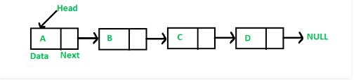
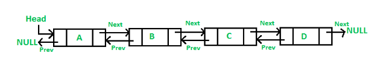

# Linked List

Last lesson, we studied Array. Array is index based data structure where each element associated with an index. About phisical, elements in an array are stored in sequential memory locations. If you have an array with 1000 integers, suppose each integer is 4 bytes, when you declare and initialize it, that means you are requesting Operating System allocate 4000 sequential bytes in memory. What happen if your memory don't have enough sequential bytes, your program will be crash with out of stack memory error.

Lets consider below case: 
Your memory has 5000 bytes free. Although that, you can't allocate above array because array need sequential memory. This is the key feature you should remember for array.


To solve this issue, we will learn a new data structure **Linked List**

A linked list is a way to store a collection of elements. Like an array these can be character or integers. Each element in a linked list is stored in the form of a **node**.

A node is a collection of two parts. A data part that stores the element value and link part that stores the link to the next node (singly linked list) or to the previous and the next nodes (doubly linked list).

The first node in the list is called **HEAD**, the last points to **NULL**.

Singly linked list
 

Doubly linked list


Each node can locate in everywhere in memory, that mean you don't need to have sequential memory to allocate a linked list. Moreover, you can only access a node by previous node instead of by index.

## Implement Linked List
Now, we try to implement an integer linked list with only link to next node (singly linked list)

### Create Linked List and Node Classes

```php
class Node {
    /** @var int */
    private $data;
    /** @var Node */ 
    private $next; 

    /**
    * Constructor Node class
    */
    public function __construct($data = 0, $next = null) // default value of $data is 0, $next is null
    {
        $this->data = $data; // initial $data
        $this->next = $next;  // initial $next
    }

    /**
    * get data
    * @return int
    */
    public function getData()
    {
        return $this->data;
    }

    /**
    * set data
    * @param int $data
    */
    public function setData($data)
    {
        $this->data = $data;
    }

    /**
    * get next
    * @return Node
    */
    public function getNext()
    {
        return $this->next;
    }

    /**
    * set next
    * @param Node $next
    */
    public function setNext($next)
    {
        $this->next = $next;
    }
    
} 

class LinkedList { 
    /** @var Node  head node */
    private $head;
}

```

### Insert Node to Linked List
```php
class LinkedList { 
    //....

    /**
    *@param int $data
    */
    public function insert($data)
    {
        $newNode = new Node($data); // create a Node
        if ($this->head == null) {
            // if the head is null, that mean linked list is empty, so the first node is head
            $this->head = $newNode;
        } else {
            // if linked list is not null, new node will be add to end of list
            // find the last node
            $last = $this->head; 
            while ($last->getNext() != null) { 
                $last = $last->getNext();
            }
            // insert new node to at last node
            $last->setNext($newNode);
        }
    }
}

```

### Vist Linked List
We will traversal all element of linked list: 

```php
class LinkedList { 
    //....

    /**
    * traversal linked list
    */
    public function visit()
    {
        $currNode = $this->head; // start from head node

        echo "Linked List: ";

        while ($currNode != null) { //stop when node is NULL
            echo $currNode->getData() . " ";
            $currNode = $currNode->getNext(); // get next node
        }
    }

    //....
```

Now, we have a full program. Lets test it:
```php
class Node {
    /** @var int */
    private $data;
    /** @var Node */ 
    private $next; 

    /**
    * Constructor Node class
    */
    public function __construct($data = 0, $next = null)  // default value of $data is 0, $next is null
    {
        $this->data = $data; // initial $data
        $this->next = $next;  // initial $next
    }

    /**
    * get data
    * @return int
    */
    public function getData()
    {
        return $this->data;
    }

    /**
    * set data
    * @param int $data
    */
    public function setData($data)
    {
        $this->data = $data;
    }

    /**
    * get next
    * @return Node
    */
    public function getNext()
    {
        return $this->next;
    }

    /**
    * set next
    * @param Node $next
    */
    public function setNext($next)
    {
        $this->next = $next;
    }
    
} 

class LinkedList { 
    /** @var Node  head node */
    private $head;

    /**
    *@param int $data
    */
    public function insert($data)
    {
        $newNode = new Node($data); // create a Node
        if ($this->head == null) {
            // if the head is null, that mean linked list is empty, so the first node is head
            $this->head = $newNode;
        } else {
            // if linked list is not null, new node will be add to end of list
            // find the last node
            $last = $this->head; 
            while ($last->getNext() != null) { 
                $last = $last->getNext();
            }
            // insert new node to at last node
            $last->setNext($newNode);
        }
    }

    /**
    * traversal linked list
    */
    public function visit()
    {
        $currNode = $this->head; // start from head node

        echo "Linked List: ";

        while ($currNode != null) {
            echo $currNode->getData() . " ";
            $currNode = $currNode->getNext();
        }
    }
}

$list = new LinkedList(); // init linked list: $head = null
$list->insert(5); //insert first node with value equal 5, $head->value = 5
$list->insert(4); // (5) -> (4)
$list->insert(10); // (5) -> (4) -> (10)

$list->visit(); // visit linked list

//Result: Linked List: 5 4 10
```

## Exercise

### Problem
Given an integer linked list and a number N. Delete first element that has N value.

### Solution
This is a searching problem. Beside, what happen if a node is removed from linked list. Suppose you want to delete node B, A is previous node of B and C is next node of B: (A) -> (B) -> (C). You access B from A and C from B, so if we just delete B and nothing else, (C) will be never to access because there is no its reference node. Think logically, all nodes which follow (C) can't be accessed too.

In this case, we will process with following solution:
```pseudocode
1. If node found is head, change the head to next node of head
2. If node found is middle or last, find the previous node of the found node, then change 3. Delete found node (In some languages, we have to free memory (C, C++); some languages we do nothing because its done by language (Java, php))
```

```php
class LinkedList {
//...

/**
* delete first node which have value is $data
* @param int $data
*/
public function deleteFirst($data)
{
    if ($this->head == null) { // linked list is empty
        echo "List is empty.";
        return;
    }
    if ($this->head->getData() == $data) { //found node is head
        $this->head = $this->head->getNext();
    } else {
        $current = $this->head;
        while ($current->getNext() != null) {
            if ($current->getNext()->getData() == $data) { // found node
                $current->setNext($current->getNext()->getNext());
                return;
            }
        }
        echo "Not found.";
    }
}

//...
}

$list = new LinkedList(); // init linked list: $head = null
$list->insert(5); //insert first node with value equal 5, $head->value = 5
$list->insert(4); // (5) -> (4)
$list->insert(10); // (5) -> (4) -> (10)

$list->visit(); // 5 4 10

$list->deleteFirst(4);
$list->visit(); // 5 10

$list->deleteFirst(5);
$list->visit(); // 10

$list->deleteFirst(1); // Not found.
$list->visit(); // 10

```

## Homework
1. (Easy) Given an integer linked list and a number N. Delete all elements that has N value.

|   Input Linked List  | Input N| Output Linked List|
|------------|--------|---------|
| 10 4 1 2 5 2 3   | 10 | 4 1 2 5 2 3 |
| 10 4 1 2 5 2 3   | 2 | 10 4 1 5 3 |

2. (Normal) Give an integer linked list. Print all elements as reversed order.

|   Input Linked List | Output |
|------------|---------|
| 1 2 3 4 5 | 5 4 3 2 1|

3. (Hard) Given N people (name, age) and an integer M. Each person can follow another freely but the number of follower of one person is not bigger than M. Print all follower of one person.