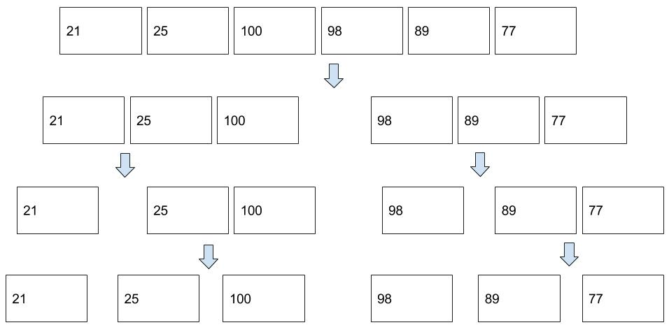
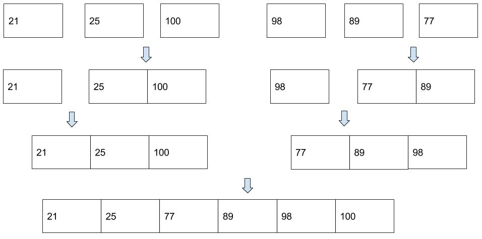

# Merge Sort

Merge Sort divides input array in two halves, calls itself for the two halves and then merges the two sorted halves. The merge() function is used for merging two halves. The merge(arr, l, m, r) is key process that assumes that arr[l..m] and arr[m+1..r] are sorted and merges the two sorted sub-arrays into one.

## Problem to Solve

Given a list of numbers as shown below, please sort them in ascending order.
```php
$numbers = [21,25,100,98,89,77];
```

## Pseudocode

Merge Sort is a divide and conquer algorithm. It works by continually splitting a list in half until both halves are sorted, then the operation merge is performed to combine two lists into one sorted new list.


When splitting a list, we consider the list is sorted if it contains zero or one element.

### How Merge Sort Works?

1. Using the Divide and Conquer technique, we divide a problem into subproblems.



2. When the solution to each subproblem is ready, we 'combine' the results from the subproblems to solve the main problem.



### Pseudocode of Merge Sort algorithm can be written as follows:

**Memo Pseudocode**

```php
1. Find the middle point to divide the array into two halves
2. Call mergeSort for first half
3. Call mergeSort for second half
4. Merge the two halves sorted in step 2 and 3
```

**Pseudocode**

```php
PROCEDURE function mergeSort
   FOR each element of the master list indexed by i
 
       if ( i <= 1 ) return a
 
       var left = a[0] to a[i/2]
       var right = a[i/2+1] to a[i]
 
       left = mergeSort( left )
       right = mergeSort( right )
 
       return merge( left,right )
 
   END FOR
END PROCEDURE
 
PROCEDURE function mergeSort
    WHILE length(left) > 0 and length(right) > 0
        if first(left) ≤ first(right)
            append first(left) to result
            left = rest(left)
        else
            append first(right) to result
            right = rest(right)
 
    IF length(left) > 0
        append left to result
    END IF
 
    IF length(right) > 0
        append right to result
    END IF
 
    return result
END PROCEDURE
```

## Implementation

### MergeSort function
As we can see, there are two procedures in this algorithm. This leads us to two PHP functions, where the first function(mergeSort) involves a recursion.

```php
<?php

function mergesort($numlist)
{
    if(count($numlist) == 1 ) return $numlist;
 
    //1. Find the middle point to divide the array into two halves
    $mid = count($numlist) / 2; 
    $left = array_slice($numlist, 0, $mid); //divide first half
    $right = array_slice($numlist, $mid); //second first half
 
    // 2. Call recursive mergeSort for first half
    $left = mergesort($left); 
    //3. Call recursive mergeSort for second half
    $right = mergesort($right); 
    //4. Merge the two halves sorted in step 2 and 3     
    return merge($left, $right);
}
```

### Merge function

where the second function(merge) combine first half and first half in a sorted manner.

```php
function merge($left, $right)
{
    $result=array();

    // Initial indexes of first and second subarrays 
    $leftIndex=0;
    $rightIndex=0;

    // while both arrays are still full
    while($leftIndex < count($left) && $rightIndex < count($right))
    {
        if($left[$leftIndex]>$right[$rightIndex])
        {
 
            $result[]=$right[$rightIndex];
            $rightIndex++;
        }
        else
        {
            $result[]=$left[$leftIndex];
            $leftIndex++;
        }
    }

    /* Copy remaining elements of left if any */
    while($leftIndex<count($left))
    {
        $result[]=$left[$leftIndex];
        $leftIndex++;
    }

    /* Copy remaining elements of right if any */
    while($rightIndex<count($right))
    {
        $result[]=$right[$rightIndex];
        $rightIndex++;
    }

    return $result;
}
```
- **array_slice**: It extracts a slice of the array. This function is handy when we want to a certain part of the array.

## Following is the implementations of the Merge Sort:

The code is completed.

```php
<?php

// Recrusive mergesort function
function mergesort($numlist)
{
    if(count($numlist) == 1 ) return $numlist;
 
    $mid = count($numlist) / 2;
    $left = array_slice($numlist, 0, $mid);
    $right = array_slice($numlist, $mid);
 
    $left = mergesort($left);
    $right = mergesort($right);
     
    return merge($left, $right);
}

// merge 2 sorted arrays
function merge($left, $right)
{
    $result=array();
    $leftIndex=0;
    $rightIndex=0;
 
    while($leftIndex<count($left) && $rightIndex<count($right))
    {
        if($left[$leftIndex]>$right[$rightIndex])
        {
 
            $result[]=$right[$rightIndex];
            $rightIndex++;
        }
        else
        {
            $result[]=$left[$leftIndex];
            $leftIndex++;
        }
    }
    while($leftIndex<count($left))
    {
        $result[]=$left[$leftIndex];
        $leftIndex++;
    }
    while($rightIndex<count($right))
    {
        $result[]=$right[$rightIndex];
        $rightIndex++;
    }
    return $result;
}

// A utility function to 
// print an array of size n 
function printArray(&$arr, $n) 
{ 
    for ($i = 0; $i < $n; $i++) 
        echo $arr[$i]." "; 
    echo "\n"; 
} 
  
// Driver Code 
$arr = array(21,25,100,98,89,77); 
$n = sizeof($arr); 
$arr=mergesort($arr);
printArray($arr, $n); 
?> 
```

## Output 
```php
Sorted array:
21 25 77 89 98 100
```

## Analysis

- Time Complexity: O(nLogn)
- Auxiliary Space: O(n)