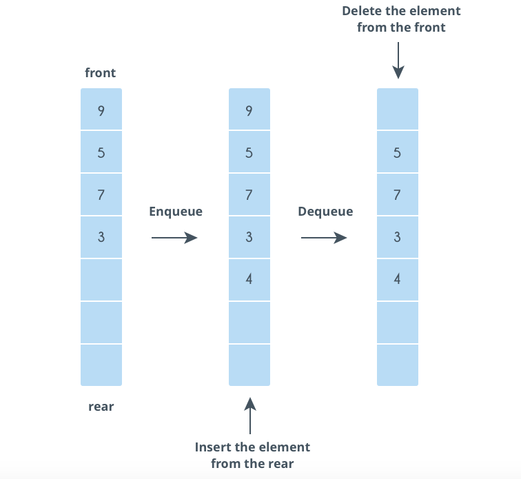

# Queue
Queues are data structures that follow the **First In First Out** (FIFO) i.e. the first element that is added to the queue is the first one to be removed.

Elements are always added to the back and removed from the front. Think of it as a line of people waiting for a bus. The person who is at the beginning of the line is the first one to enter the bus.

The position to insert element is called **rear** and **front** is the deletion position. Inserted operation is called **enqueue** and deleted operation is called **dequeue**. The following picture demonstrates for working principle of queue.



## Implement Queue

We will implement a queue of integers with two operations enqueue and dequeue. Beside, **front** function is to get the front element, **isEmpty** use to check whether queue is empty. To be more simple, we will use array to contain integers.

Declare queue class
```php
class Queue {
    /** @var array queue element */
    private $elements;

    public function __construct()
    {
        $this->elements = array(); //initialize queue element
    }

    /**
    * insert an element
    * @param int $num
    * @return void
    */
    public function enqueue($num)
    {
    }

    /**
    * delete front element
    * @return void
    */
    public function dequeue()
    {
    }

    /**
    * get front element
    * @return int
    */
    public function front()
    {
    }

    /**
    * check queue is empty or not
    * @return boolean
    */
    public function isEmpty()
    {
    }
}

```

Implement enqueue function
```php
/**
* insert an element
* @param int $num
* @return void
*/
public function enqueue($num)
{
    array_unshift($this->elements, $num); //array_unshift: Prepend one or more elements to the beginning of an array (https://www.php.net/manual/en/function.array-unshift.php)
}

```

Implement dequeue function
```php
/**
* delete front element
* @return void
*/
public function dequeue()
{
    if (!$this->isEmpty()) { //check if queue is not empty
        unset($this->elements[sizeof($this->elements) - 1]); // same to pop function in stack
    }
}

```

Implement front function
```php
/**
* get front element
* @return int
*/
public function front()
{
    if (!$this->isEmpty()) {
        return $this->elements[sizeof($this->elements) - 1]; // same to top function in stack
    }

    return null;
}

```

Implement isEmpty function
```php
/**
* check queue is empty or not
* @return boolean
*/
public function isEmpty()
{
    return empty($this->elements);
}

```

## Exercise
### Problem
Implement a queue of string and print all elements
### Solution
```php
<?php
class Queue {
    /** @var array queue element */
    private $elements;

    public function __construct()
    {
        $this->elements = array(); //initialize queue element
    }

    /**
    * insert an element
    * @param string $ele
    * @return void
    */
    public function enqueue($ele)
    {
        array_unshift($this->elements, $ele); 
    }

    /**
    * delete front element
    * @return void
    */
    public function dequeue()
    {
        if (!$this->isEmpty()) { //check if queue is not empty
            unset($this->elements[sizeof($this->elements) - 1]); // same to pop function in stack
        }
    }

    /**
    * get front element
    * @return string
    */
    public function front()
    {
            if (!$this->isEmpty()) {
            return $this->elements[sizeof($this->elements) - 1]; // same to top function in stack
        }

        return null;
    }

    /**
    * check queue is empty or not
    * @return boolean
    */
    public function isEmpty()
    {
        return empty($this->elements);
    }
}

$queue = new Queue(); // declare a queue:()
$queue->enqueue("A"); // insert A to queue:(A) 
$queue->enqueue("B"); // insert B to queue:(BA)
$queue->enqueue("C"); // insert B to queue:(CBA)

while(!$queue->isEmpty()) {
    echo $queue->front() . " ";
    $queue->dequeue();
}

//Result: A B C

```


### Homework
1. (Medium) Imagine you are a secretary. Everyday, you recieve a list of tasks from your boss. Tasks are named from 1 to N and their orders represent priority. 
Example, you have 3 tasks: 2, 1, 3 => task 2 is highest priority and 3 is lowest priority.

Beside, because these tasks is depend on each others, so you also have a dependent task list. Example, dependency task list is 1, 2, 3 => task 2 is only processed after processing task 1 and task 3 is ony processed after processing task 2.

From the order task list, you have to process highed priority task first. In case this task cannot be processed because it depends on other, we have to reduce its priority to lowest (push it to the last of priority list). Otherwise, you process this task and remove it from list. Suppose, you take 2 unit of time to process or 1 unit of time to change task priority.

Example, with priority tasks: 2, 1, 3; dependent tasks: 1, 2, 3
- First iteration: you take task 2 to process but it depends on task 1 (unfinished task), so you have to change priority to: 1, 3, 2. You take 1 unit of time
- Second iteration: you take task 1, it doesn't depend on other, so you process it and take 2 unit of time
- ...so on

Write a program to solve this problem. Input includes a number N, a priority task list and a dependecy task list. Output is the time taken to process these tasks.

|Input|Output|
|-----|------|
|N = 3 <br> Priority tasks: 2, 1, 3 <br> Dependent list: 1, 2, 3|8|