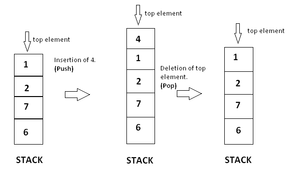

# Stack

Lets start with following problem in the life. 

*Chair folding:* imagine your family have some chairs used for dinner, lunch. When ending the meal, you have to fold them because you don't have enough space in your room (below image). 
Your big son likes yellow chair, his younger sister likes pink one, blue for your wife, grey for your mother and green for you. After your lunch, you fold them as the order green, grey, blue, pink, yellow. A question is that what is the order when you take them to prepare the dinner? Its same your order folding: green, grey, blue, pink, yellow -> No, its wrong. The correct answer is: yellow, pink, blue, grey, green. You can take only the chair that you folded last, it also means the first you folded, the last you take. Is it easy?? Hahaha, Its so simple. And **Stact** is nothing more than folding chairs.

**Stack** is dynamic data structures that follow the Last In First Out (LIFO) principle. The last item to be inserted into a stack is the first one to be deleted from it.

The last item is called the **top** element. Stack support **inserted** and **deleted** operations only at top element. Inserted operation is called **push()** and deleted operation is called **pop()**.

A stack with operations can be visuallized as follows:


## Implement Stack

We will implement a stack of integers with two operations pop and push. Beside, **top** function is to get the top element, **isEmpty** use to check whether stack is empty. To be more simple, we will use array to contain integers.

Declare stack class
```php
class Stack {
    /** @var array stack element */
    private $elements;

    public function __construct()
    {
        $this->elements = array(); //initialize stack element
    }

    /**
    * insert an element
    * @param int num
    * @return void
    */
    public function push(num)
    {
    }

    /**
    * delete top element
    * @return void
    */
    public function pop()
    {
    }

    /**
    * get top element
    * @return int
    */
    public function top()
    {
    }

    /**
    * check stack is empty or not
    * @return boolean
    */
    public function isEmpty()
    {
    }
}

```
We use an array to contain elements, so why we don't set it public or implement a getter function for it? Because if we do that, we can access every element in stack, its not a stack (Haha).

Implement push function
```php
/**
* insert an element
* @param int num
* @return void
*/
public function push(num)
{
    $this->elements[] = num; //In php, this assignment will add element to the end of an array
}

```

Implement pop function
```php
/**
* delete top element
* @return void
*/
public function pop()
{

    if (!$this->isEmpty()) { //check if stack is not empty
        unset($this->elements[sizeof($this->elements) - 1]); // unset use to destroy a variable (https://www.php.net/manual/en/function.unset)
    }
}

```

Implement top function
```php
/**
* get top element
* @return int
*/
public function top()
{
    if (!$this->isEmpty()) {
        return $this->elements[sizeof($this->elements) - 1];
    }

    return null;
}

```

Implement isEmpty function
```php
/**
* check stack is empty or not
* @return boolean
*/
public function isEmpty()
{
    return empty($this->elements);
}

```

## Exercise
### Problem
Today, we will solve the problem: check for balanced parentheses in an mathematical expression.
```math
(a + b - (c + d)): balanced
{a * [b - (c + d)]}: balanced
a + (c - d)): not balanced
[(a - b] * c): not balanced
```
### Solution
We start to analysis this problem. We have 3 types of bracket used in expresion: {}, [] and (). An expression is balanced parentheses if:
- Total starting bracket is equal total closing bracket for every type
- Every closing bracket must match to *nearest starting bracket before it* after remove all pair of matched bracket before it.
```math
[a + {(b - c) * d]}

- total starting bracket: 1 {, 1 [, 1( - total closing bracket: 1 }, 1 ], 1) => its ok
- `)` is matched to `)`: its ok, remove this pair: [a + { * d]}
- `]` is not matched to `{`, so its not ok.
=> Not balanced

```

According to above example, we process expression from left to right, we compare closing bracket to nearest front starting bracket, we remove pair of matched. All them seems very familiar to Stack.

Implement
```php
/**
* Implement stack of string
*/
<?php
class Stack {
    /** @var array stack element */
    private $elements;

    public function __construct()
    {
        $this->elements = array(); //initialize stack element
    }

    /**
    * insert an element
    * @param string num
    */
    public function push($ele)
    {
        $this->elements[] = $ele;
    }

    /**
    * delete top element
    */
    public function pop()
    {
        if (!$this->isEmpty()) { //check if stack is not empty
            unset($this->elements[sizeof($this->elements) - 1]); // unset use to destroy a variable (https://www.php.net/manual/en/function.unset)
        }
    }

    /**
    * get top element
    * @return string
    */
    public function top()
    {
        if (!$this->isEmpty()) {
            return $this->elements[sizeof($this->elements) - 1];
        }

        return null;
    }

    /**
    * check stack is empty or not
    * @return boolean
    */
    public function isEmpty()
    {
        return empty($this->elements);
    }
}

function balancedParenthese($expression)
{
    if (empty($expression)) {
        return 'Expression is empty.';
    }

    /** match starting and closing bracket */
    $matches = array(
        ')' => '(',
        ']' => '[',
        '}' => '{',
    );

    $stack = new Stack(); //init a stack
    for ($i = 0; $i < strlen($expression); $i++) { // strlen($string): get length of a string
        switch ($expression[$i]) {
            case '(':
            case '{':
            case '[':
                $stack->push($expression[$i]); // push starting bracket
                break;
            case ')':
            case '}':
            case ']':
                $top = $stack->top(); // get starting bracket
                $stack->pop(); // delete starting bracket
                if ($top != $matches[$expression[$i]]) {
                    return "Not Balanced"; // if closing bracket and nearest starting is not matched
                }
            default:
				break;
        }
    }

    if (!$stack->isEmpty()) {
        return "Not Balanced"; // if there are remain starting bracket
    }

    return "Balanced";
}
echo balancedParenthese('(a + b - (c + d))') . "\n";
echo balancedParenthese('{a * [b - (c + d)]}') . "\n";
echo balancedParenthese('a + (c - d))') . "\n";
echo balancedParenthese('[(a - b] * c)') . "\n";

/*Result:
Balanced
Balanced
Not Balanced
Not Balanced
*/

```

## Homework
1. (Easy) A and B are playing a game. In this game, both of them are initially provided with a **list of N numbers**. (Both have the same list but their own copy).

Now, they both have a different strategy to play the game. A picks the element from **start of his list**. B picks from **the end of his list**.

You need to generate the result in form of an output list.

Method to be followed at each step to build the output list is:

- If the number picked by **A is bigger than B** then this step's output is 1. B removes the number that was picked from their list.
- If the number picked by **A is smaller than B** then this step's output is 2. A removes the number that was picked from their list.
- If both have **the same number** then this step's output is 0. Both A and B remove the number that was picked from their list.

This game ends when at least one of them has no more elements to be picked i.e. when the list gets empty.

Output the built output list.

|Input|Output|
|-----|------|
|1 2 3|2 2 0|
|2 1 3 2|0 2 0 1 0|