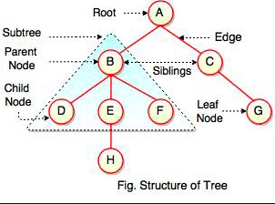
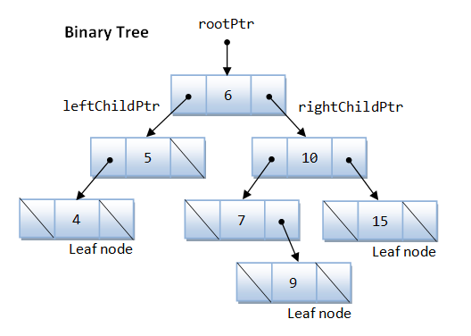
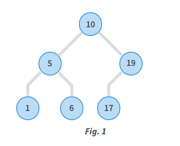

# Tree
In this chapter, we will go next to a new data structure, its more complicate than others we've learned.

**Tree** represents the nodes connected by edges. We have some terminologies:
- **Root**: Top node in a tree
- **Child**: Nodes that are next to each other and connected downwards
- **Parent**: Converse notion of child
- **Siblings**: Nodes with the same parent
- **Descendant**: Node reachable by repeated proceeding from parent to child
- **Ancestor**: Node reachable by repeated proceeding from child to parent.
- **Leaf**: Node with no children
- **Internal node**: Node with at least one child
- **External node**: Node with no children

You see, same to tree in natural, we have root, leaf. Thats why we name its tree.



## Binary Tree

A binary tree is a structure comprising nodes, where each node has the following 3 components:

- Data element: Stores any kind of data in the node
- Left pointer: Points to the tree on the left side of node
- Right pointer: Points to the tree on the right side of the node
As the name suggests, the **data** element stores any kind of data in the node.
The **left** and **right** pointers point to binary trees on the left and right side of the node respectively.

If a tree is empty, it is represented by a **null** pointer.

The following image explains the various components of a tree.



## Binary Search Tree

**Binary Search Tree** is a node-based binary tree data structure which has the following properties:

- The left subtree of a node contains only nodes with keys lesser than the node’s key.
- The right subtree of a node contains only nodes with keys greater than the node’s key.
- The left and right subtree each **must** also be a binary search tree.



In Fig. 1, consider the root node with data = 10.

- Data in the left subtree is: [5, 1, 6].
All data elements are < 10 
- Data in the right subtree is: [19, 7].
All data elements are > 10

Also, considering the root node with data = 5, its children also satisfy the specified ordering. Similarly, the root node with data = 19 also satisfies this ordering. When recursive, all subtrees satisfy the left and right subtree ordering.

## Exercise
### Problem 1
We will implement following Binary Tree by php


### Solution
```php
<?php

/**
* A node of Binary Tree (BT)
*/
class Node {
    /** @var int */
    private $data;

    /** @var Node left subtree */
    private $left;

    /** @var Node right subtree */
    private $right;

    public function __construct($data, $left = null, $right = null)
    {
        $this->data = $data;
        $this->left = $left;
        $this->right = $right;
    }

    /**
    * get data
    * @return int
    */
    public function getData()
    {
        return $this->data;
    }

    /**
    * set data
    * @param int $data
    */
    public function setData($data)
    {
        $this->data = $data;
    }

    /**
    * get left
    * @return Node
    */
    public function getLeft()
    {
        return $this->left;
    }

    /**
    * set left
    * @param Node $left
    */
    public function setLeft($left)
    {
        $this->left = $left;
    }

    /**
    * get right
    * @return Node
    */
    public function getRight()
    {
        return $this->right;
    }

    /**
    * set right
    * @param Node $right
    */
    public function setRight$right)
    {
        $this->right = $right;
    }
}

/**
* Binary Tree Class
*/
class BT {
    /** @var Node */ 
    private $root;

    public function __construct($root = null)
    {
        $this->root = $root;
    }

    /**
    * get root
    * @return Node
    */
    public function getRoot()
    {
        return $this->root;
    }

    /**
    * set root
    * @param Node $root
    */
    public function setRoot($root)
    {
        $this->root = $root;
    }

}

// three leaves
$left1 = new Node(4);
$left2 = new Node(9);
$left3 = new Node(15);
// parent nodes
$parent1 = new Node(5, left1); //its child is 5 (left child)
$parent2 = new Node(7, null, $left2); //its child is 9 (right child)
$parent3 = new Node(10, $parent2, $left3); //its children are 7(left) and 15 (right)
//root
$root = new Node(6, $parent1, $parent3); //root node
//tree
$bt = new BT($root);

```

### Problem 2

## Homework